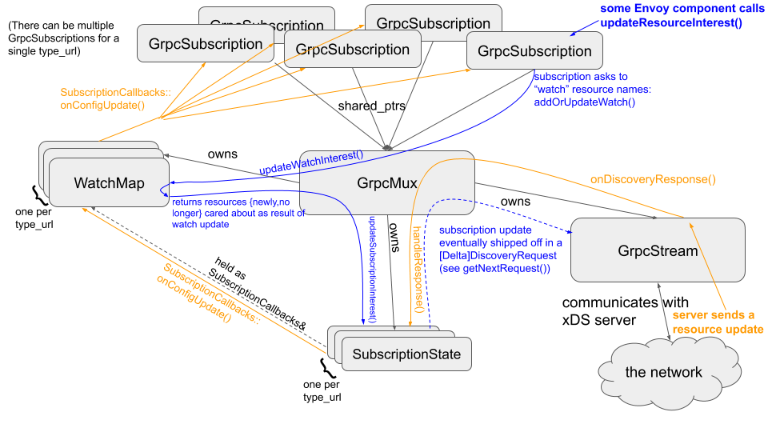

# XDS模块1

本部分主要介绍envoy中XDS模块，包括XDS协议，XDS源码解析等。

[xDS REST and gRPC protocol](https://www.envoyproxy.io/docs/envoy/latest/api-docs/xds_protocol#basic-protocol-overview)

## 概述

Envoy是由lyft开源的边缘和和服务代理，后被捐赠给CNCF基金会，被Isito以及多个k8s Ingress gateway所采用。xDS，Envoy 的Data Plane API，可以说已经是云原生时代数据平面API的事实标准，同为CNCF下的GRPC甚至开始支持xDS（https://github.com/grpc/grpc-go/tree/master/xds）。与nginx等相比，Envoy可以通过xDS实现配置的完全动态化，配置实时更新而无需重启Envoy或者影响业务。

那么xDS是如何做到的呢？

实际上，x表示这是个控制协议由多个细分控制协议组成，且具有很强的扩展性。具体来说，包括Endpoint Discovery Service (EDS)、Cluster Discovery Service (CDS)、Route Discovery Service (RDS)、Listener Discovery Service (LDS)、Secret Discovery Service (SDS)、Runtime Discovery Service（RTDS）以及ADS等。

## v3 XDS资源类型

```c++
envoy.config.listener.v3.Listener

envoy.config.route.v3.RouteConfiguration

envoy.config.route.v3.ScopedRouteConfiguration

envoy.config.route.v3.VirtualHost

envoy.config.cluster.v3.Cluster

envoy.config.endpoint.v3.ClusterLoadAssignment

envoy.extensions.transport_sockets.tls.v3.Secret

envoy.service.runtime.v3.Runtime
```

在XDS中，每种资源由资源类型`type URL`表示，其表示形式如下所示

```c++
type.googleapis.com/<resource type>
```

譬如Cluster类型的资源，可表示如下形式

```c++
type.googleapis.com/envoy.config.cluster.v3.Cluster
```

## XDS协议变体

XDS目前拥有四种协议变体，分别为

```c++
State of the World (Basic xDS): SotW, separate gRPC stream for each resource type // 每种类型的资源 占用其自己的grpc stream

Incremental xDS: incremental, separate gRPC stream for each resource type 

Aggregated Discovery Service (ADS): SotW, aggregate stream for all resource types // 所有的资源类型，共用同一个grpc stream

Incremental ADS: incremental, aggregate stream for all resource types
```

## XDS关键原理

交互流程分为Request、Response、Ack/Nack。

具体可参考下图


## XDS架构

envoy中XDS主要分为Sotw和Delta两种形式，本部分先讲解Sotw相关架构和源码解析。

由于xds模块实现较为复杂，因此会分成多篇文章讲解。

关于XDS相关架构，官方文档给出了下图


上图涉及了XDS 所需要的各个组件以及相应的交互流程。

为了更近一步理解相应的组件之间的依赖关系，本文给出CDS场景下，相应的架构图


## XDS接口

xDS的接口比较简单，无论是CDS、EDS、LDS、RDS等，接口是一样的，由三个方法组成：

```c++
1、rpc StreamEndpoints(stream discovery.v3.DiscoveryRequest) returns (stream discovery.v3.DiscoveryResponse)

2、rpc DeltaEndpoints(stream discovery.v3.DeltaDiscoveryRequest) returns (stream discovery.v3.DeltaDiscoveryResponse)

3、rpc FetchEndpoints(discovery.v3.DiscoveryRequest) returns (discovery.v3.DiscoveryResponse)
```
例如https://github.com/envoyproxy/envoy/blob/master/api/envoy/service/endpoint/v3/eds.proto

接口虽然简单，但DiscoveryRequest、DiscoveryResponse资源格式灵活且复杂。具体来说如下：


## 总结

本篇文章主要介绍支持Sotw协议时，envoy中所实现的XDS相关的架构。


