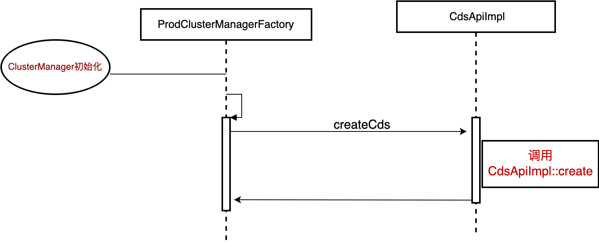
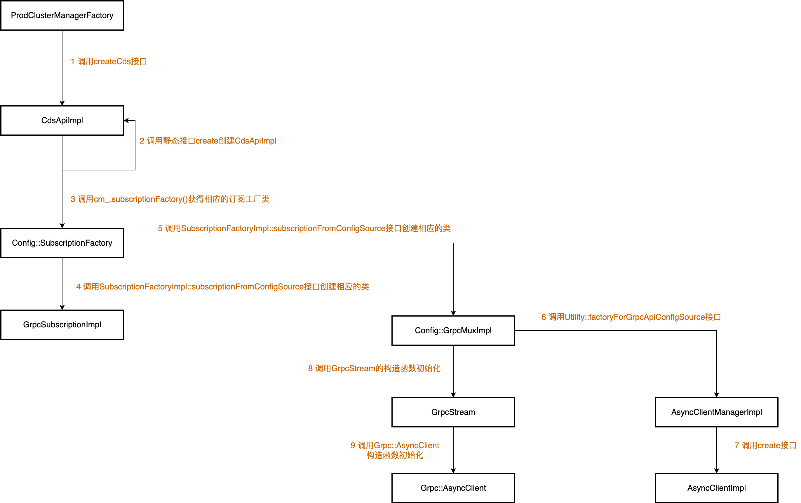

# XDS模块2

本部分以CDS为例，讲解Sotw协议的源码实现。

相应的架构和配置文件可参考

[XDS模块1](./XDS模块(1).md)

[XDS模块2](./XDS模块(2).md)

## 关键类说明

**GrpcStream**

```c++
/* 声明:*/
template <class RequestProto, class ResponseProto>
class GrpcStream : public Grpc::AsyncStreamCallbacks<ResponseProto>

/* 关键属性:*/

// Grpc异步client，用来创建grpc stream
Grpc::AsyncClient<RequestProto, ResponseProto> async_client_;
// Grpc异步client创建的异步stream
Grpc::AsyncStream<RequestProto> stream_{};
// 异步stream的回调函数，收到control plane response后触发
GrpcStreamCallbacks<ResponseProto>* const callbacks_;
// Grpc Server handler的相关信息
const Protobuf::MethodDescriptor& service_method_;

/* 关键接口: */
// 创建新的Stream，成功后会发起DiscoveryRequest
void establishNewStream()
// 发送消息，消息为DiscoveryRequest或DeltaDiscoveryRequest
void sendMessage(const RequestProto& request)
// Stream收到消息，为DiscoveryResponse或DelataDiscoveryResponse
void onReceiveMessage(ResponseProtoPtr<ResponseProto>&& message)

```

**GrpcMuxImpl**

```c++
/* 声明:*/
class GrpcMuxImpl : public GrpcMux,
                    public GrpcStreamCallbacks<envoy::service::discovery::v3::DiscoveryResponse>,
                    public Logger::Loggable<Logger::Id::config>

/* 关键属性:*/
// 创建的GrpcStream实例，用来通信
GrpcStream<envoy::service::discovery::v3::DiscoveryRequest,
envoy::service::discovery::v3::DiscoveryResponse>
grpc_stream_;
// 请求的api的状态，key为api的类型，如cds、eds等
absl::node_hash_map<std::string, ApiState> api_state_;
// 订阅的资源名称，就是type_urls
std::list<std::string> subscriptions_;
// stream对应的发送队列，先进队列再发送
std::unique_ptr<std::queue<std::string>> request_queue_;

/* 关键接口: */
// 添加新的watch，格式见下图
GrpcMuxWatchPtr addWatch(const std::string& type_url, const std::set<std::string>& resources,
SubscriptionCallbacks& callbacks,
OpaqueResourceDecoder& resource_decoder)

// 处理ControlPlane返回的DiscoveryResponse
void
onDiscoveryResponse(std::unique_ptr<envoy::service::discovery::v3::DiscoveryResponse>&& message,
ControlPlaneStats& control_plane_stats)
//执行DiscoveryRequest的发送，消息缓存在ApiState里
void sendDiscoveryRequest(const std::string& type_url);
//将要发送的消息加入发送队列
void queueDiscoveryRequest(const std::string& queue_item);
```

**ApiState**

```c++
/* 声明:*/
struct ApiState

/* 关键属性:*/
// 这个API上所有的Watch
std::list<GrpcMuxWatchImpl*> watches_;
// 当前的DiscoveryRequest，发送时复用
envoy::service::discovery::v3::DiscoveryRequest request_;

/* 关键接口: */

```

**GrpcSubscriptionImpl**

```c++
/* 声明:*/
class GrpcSubscriptionImpl : public Subscription,
                             SubscriptionCallbacks,
                             Logger::Loggable<Logger::Id::config>

/* 关键属性:*/
//所使用的GrpcMux
GrpcMuxSharedPtr grpc_mux_;
//所使用的资源类型
const std::string type_url_;
//下游的Subscription，为XDSApi的Impl
SubscriptionCallbacks& callbacks_;
//所使用watch
GrpcMuxWatchPtr watch_; 

/* 关键接口: */
//配置更新触发的回调，由全量更新的触发
void onConfigUpdate(const std::vector<Config::DecodedResourceRef>& resources,
const std::string& version_info) override;

//配置更新触发的回调，由增量更新的触发
void onConfigUpdate(const std::vector<Config::DecodedResourceRef>& added_resources,
const Protobuf::RepeatedPtrField<std::string>& removed_resources,
const std::string& system_version_info)

//启动并watch这些资源
void start(const std::set<std::string>& resource_names) ;

//变更watch的资源
void updateResourceInterest(const std::set<std::string>& update_to_these_names)

```

**GrpcMuxWatchImpl**

```c++
/* 声明:*/
struct GrpcMuxWatchImpl : public GrpcMuxWatch

/* 关键属性:*/
//订阅的所有资源的name
std::set<std::string> resources_;
//watch callback函数
SubscriptionCallbacks& callbacks_; 一般为GrpcSubscriptionImpl
//resource反序列化
OpaqueResourceDecoder& resource_decoder_;
//资源类型
const std::string type_url_;
//关联的GrpcMux
GrpcMuxImpl& parent_;
//该type api所有的watches
std::list<GrpcMuxWatchImpl*>& watches_;

/* 关键接口: */
// 更新需要watch的资源
void update(const std::set<std::string>& resources)
```

**CdsApiImpl**

```c++
/* 声明:*/
class CdsApiImpl : public CdsApi,
                   Envoy::Config::SubscriptionBase<envoy::config::cluster::v3::Cluster>,
                   Logger::Loggable<Logger::Id::upstream>

/* 关键属性:*/
//集群管理器，最核心的类之一
ClusterManager& cm_;
//GrpcSubscription实例
Config::SubscriptionPtr subscription_;

/* 关键接口: */
//资源更新回调。added_resources包括新增+变更的。removed_resources为删除的资源
void onConfigUpdate(const std::vector<Config::DecodedResourceRef>& added_resources,
const Protobuf::RepeatedPtrField<std::string>& removed_resources,
const std::string& system_version_info) override;
```

从对象的嵌套的角度看，嵌套关系如下图所示：


即一个GrpcMux维护一个Map，key为type_Url, 例如type.googleapis.com/envoy.config.cluster.v3.Cluster，value为对应的ApiState。而ApiState里维护着WatchList，每个Watch维护一组resource name和对应这些资源变更的回调函数。


## 源码讲解

### cds api初始化

在source/common/upstream/cluster_manager_impl.cc的ClusterManagerImpl::ClusterManagerImpl构造函数中有如下实现

```c++
// We can now potentially create the CDS API once the backing cluster exists.
  if (dyn_resources.has_cds_config()) {
    cds_api_ = factory_.createCds(dyn_resources.cds_config(), *this);
    init_helper_.setCds(cds_api_.get());
  }
```
上述createCds接口的调用时序图如下所示


## XDS核心逻辑初始化

本部分讲解Sotw协议变体时，envoy中xds相关的核心实现，也即CdsApiImpl中subscription_的初始化。

subscription_的初始化时刻在CdsApiImpl的构造函数中，其位于source/common/upstream/cds_api_impl.cc，有如下实现

```c++
subscription_ = cm_.subscriptionFactory().subscriptionFromConfigSource(
      cds_config, Grpc::Common::typeUrl(resource_name), *scope_, *this, resource_decoder_);
```

上述cm_.subscriptionFactory().subscriptionFromConfigSource接口会调用 位于source/common/config/subscription_factory_impl.cc中的SubscriptionFactoryImpl::subscriptionFromConfigSource接口，

该函数接口声明如下
```c++
SubscriptionPtr SubscriptionFactoryImpl::subscriptionFromConfigSource(
    const envoy::config::core::v3::ConfigSource& config, absl::string_view type_url,
    Stats::Scope& scope, SubscriptionCallbacks& callbacks,
    OpaqueResourceDecoder& resource_decoder)
```

上述参数说明如下：

**config:** 配置文件中的ConfigSource配置选项

**type_url:** 资源类型，其构造过程在CdsApiImpl构造函数中，具体实现如下

```c++
const auto resource_name = getResourceName();
Grpc::Common::typeUrl(resource_name);
```

**callbacks:** 该callbacks即为CdsApiImpl

回到SubscriptionFactoryImpl::subscriptionFromConfigSource函数，该函数有如下实现，负责初始化相应的**GrpcSubscriptionImpl实例 以及其grpc_mux_成员变量等**

```c++
switch (api_config_source.api_type()) {
    case envoy::config::core::v3::ApiConfigSource::hidden_envoy_deprecated_UNSUPPORTED_REST_LEGACY:
      throw EnvoyException(
          "REST_LEGACY no longer a supported ApiConfigSource. "
          "Please specify an explicit supported api_type in the following config:\n" +
          config.DebugString());
    case envoy::config::core::v3::ApiConfigSource::REST:
      ..........
    // Sotw+grpc
    case envoy::config::core::v3::ApiConfigSource::GRPC:
      return std::make_unique<GrpcSubscriptionImpl>(
          std::make_shared<Config::GrpcMuxImpl>(
              local_info_,
              Utility::factoryForGrpcApiConfigSource(cm_.grpcAsyncClientManager()，api_config_source, scope, true)
                  ->create(),
              dispatcher_, sotwGrpcMethod(type_url, api_config_source.transport_api_version()),
              api_config_source.transport_api_version(), random_, scope,
              Utility::parseRateLimitSettings(api_config_source),
              api_config_source.set_node_on_first_message_only()),
          callbacks, resource_decoder, stats, type_url, dispatcher_,
          Utility::configSourceInitialFetchTimeout(config),
          /*is_aggregated*/ false);
    case envoy::config::core::v3::ApiConfigSource::DELTA_GRPC: ...........
    default:
      NOT_REACHED_GCOVR_EXCL_LINE;
```
上述实现会初始化GrpcSubscriptionImpl实例，GrpcSubscriptionImpl 的构造函数位于source/common/config/grpc_subscription_impl.h，其声明如下所示

```c++
GrpcSubscriptionImpl(GrpcMuxSharedPtr grpc_mux, SubscriptionCallbacks& callbacks,
                       OpaqueResourceDecoder& resource_decoder, SubscriptionStats stats,
                       absl::string_view type_url, Event::Dispatcher& dispatcher,
                       std::chrono::milliseconds init_fetch_timeout, bool is_aggregated);
```

参数说明:

**grpc_mux:** 用来除初始化GrpcSubscriptionImpl的grpc_mux_成员

**callbacks:** 也即CdsApiImpl

grpc_mux_成员变量的初始化语句为：

```c++
std::make_shared<Config::GrpcMuxImpl>(
              local_info_,
              Utility::factoryForGrpcApiConfigSource(cm_.grpcAsyncClientManager(),
                api_config_source, scope, true)
                  ->create(),
              dispatcher_, sotwGrpcMethod(type_url,api_config_source.transport_api_version())
```

Config::GrpcMuxImpl的构造函数位于source/common/config/grpc_mux_impl.h，其声明如下

```c++
GrpcMuxImpl(const LocalInfo::LocalInfo& local_info, Grpc::RawAsyncClientPtr async_client,
              Event::Dispatcher& dispatcher, const Protobuf::MethodDescriptor& service_method,
              envoy::config::core::v3::ApiVersion transport_api_version,
              Runtime::RandomGenerator& random, Stats::Scope& scope,
              const RateLimitSettings& rate_limit_settings, bool skip_subsequent_node);
```

参数说明：

**async_client:** 主要用来初始化其成员grpc_stream_

async_client的初始化语句为：
```c++
Utility::factoryForGrpcApiConfigSource(cm_.grpcAsyncClientManager(),api_config_source, scope, true)
                  ->create()
```
该接口行为如下
- 调用位于source/common/grpc/async_client_manager_impl.cc中的AsyncClientManagerImpl::factoryForGrpcService接口，生成相应的AsyncClientFactoryImpl实例，

- 调用AsyncClientFactoryImpl::create接口，创建位于source/common/grpc/async_client_impl.h的 AsyncClientImpl实例

**service_method:** Protobuf::MethodDescriptor类，主要用来构造grpc的http2请求，具体可参考[grpc over http2](https://github.com/grpc/grpc/blob/master/doc/PROTOCOL-HTTP2.md)

该参数的初始化语句为
```c++
sotwGrpcMethod(type_url, api_config_source.transport_api_version())
```
上述接口位于source/common/config/type_to_endpoint.cc，其实现如下
```c++
const Protobuf::MethodDescriptor&
sotwGrpcMethod(absl::string_view type_url,
               envoy::config::core::v3::ApiVersion transport_api_version) {
  const auto it = typeUrlToVersionedServiceMap().find(static_cast<TypeUrl>(type_url));
  ASSERT(it != typeUrlToVersionedServiceMap().cend());
  return *Protobuf::DescriptorPool::generated_pool()->FindMethodByName(
      it->second.sotw_grpc_.methods_[effectiveTransportApiVersion(transport_api_version)]);
}
```
在typeUrlToVersionedServiceMap()接口中会将所有的xDS method的name进行注册，具体注册接口流程可参见
```c++
TypeUrlToVersionedServiceMap* buildTypeUrlToServiceMap()
```
Protobuf::DescriptorPool::generated_pool()，该接口的功能可参考[generated_pool](https://developers.google.com/protocol-buffers/docs/reference/cpp/google.protobuf.descriptor#DescriptorPool.generated_pool.details)

[FindMethodByName](https://developers.google.com/protocol-buffers/docs/reference/cpp/google.protobuf.descriptor)


回到GrpcMuxImpl初始化, 该实例的构造函数较短，故将其实现粘贴如下

```c++
GrpcMuxImpl::GrpcMuxImpl(const LocalInfo::LocalInfo& local_info,
                         Grpc::RawAsyncClientPtr async_client, Event::Dispatcher& dispatcher,
                         const Protobuf::MethodDescriptor& service_method,
                         envoy::config::core::v3::ApiVersion transport_api_version,
                         Runtime::RandomGenerator& random, Stats::Scope& scope,
                         const RateLimitSettings& rate_limit_settings, bool skip_subsequent_node)
    : grpc_stream_(this, std::move(async_client), service_method, random, dispatcher, scope,
                   rate_limit_settings),
      local_info_(local_info), skip_subsequent_node_(skip_subsequent_node),
      first_stream_request_(true), transport_api_version_(transport_api_version) {
  Config::Utility::checkLocalInfo("ads", local_info);
}
```

上述部分说明如下

**skip_subsequent_node_:** [xDS REST and gRPC protocol](https://www.envoyproxy.io/docs/envoy/latest/api-docs/xds_protocol#basic-protocol-overview) 在**Basic Protocol Overview**部分有如下描述

> Only the first request on a stream is guaranteed to
> carry the node identifier. The subsequent discovery
> requests on the same stream may carry an empty node 
> identifier. This holds true regardless of the
> acceptance of the discovery responses on the same 
> stream. The node identifier should always be identical  
> if present more than once on the stream. It is 
> sufficient to only check the first message for the 
> node identifier as a result.

该变量便是用来保证后续XDS request不携带node id标识符。

**transport_api_version_:** 该变量便是[xDS REST and gRPC protocol](https://www.envoyproxy.io/docs/envoy/latest/api-docs/xds_protocol#basic-protocol-overview)中**Transport API version**，该变量表示 资源类型的版本，譬如资源类型是否是V3，V2甚至V4等。

**grpc_stream_:** 其同XDS server通信，发送和接收相应的 DiscoveryRequest 和 DiscoveryResponse. 

grpc_stream_的构造函数位于source/common/config/grpc_stream.h，其构造函数声明为

```c++
GrpcStream(GrpcStreamCallbacks<ResponseProto>* callbacks, Grpc::RawAsyncClientPtr async_client,
             const Protobuf::MethodDescriptor& service_method, Runtime::RandomGenerator& random,
             Event::Dispatcher& dispatcher, Stats::Scope& scope,
             const RateLimitSettings& rate_limit_settings)
```

在GrpcStream的构造函数中会初始化其成员变量async_client_，该变量的声明如下

```c++
Grpc::AsyncClient<RequestProto, ResponseProto> async_client_;
```
其构造函数声明位于source/common/grpc/typed_async_client.h，定义如下

```c++
AsyncClient() = default;
AsyncClient(RawAsyncClientPtr&& client) : client_(std::move(client)) {}
```

至此初步将CDS初始化流程讲解完毕。

其初始化过程汇总如下



## 请求流程

本文以CDS为例讲解Sotw协议在envoy中的实现，上述讲解了CDS的初始化流程，本部分主要讲解CDS如何触发grpc stream向XDS server发送请求以及解析服务。

在source/common/upstream/cluster_manager_impl.cc文件的ClusterManagerInitHelper::maybeFinishInitialize()函数中有如下代码实现

```c++
if (state_ == State::WaitingToStartSecondaryInitialization && cds_) {
    ENVOY_LOG(info, "cm init: initializing cds");
    state_ = State::WaitingToStartCdsInitialization;
    cds_->initialize();
  } 
```

关于Cluster初始化不是本文讲解的主题，因此跳过。上述代码中会调用

```c++
cds_->initialize();
```
其实现位于source/common/upstream/cds_api_impl.h，实现如下

```c++
void initialize() override { subscription_->start({}); }
```

上述会调用位于source/common/config/grpc_subscription_impl.cc中的GrpcSubscriptionImpl::start接口，其实现如下所示

```c++
void GrpcSubscriptionImpl::start(const std::set<std::string>& resources) {
  // ..........
  watch_ = grpc_mux_->addWatch(type_url_, resources, *this, resource_decoder_);
  // .....
  // ADS initial request batching relies on the users of the GrpcMux *not* calling start on it,
  // whereas non-ADS xDS users must call it themselves.
  if (!is_aggregated_) {
    grpc_mux_->start();
  }
}
```

上述实现中，首先调用GrpcMuxImpl的addWatch接口，用来初始化GrpcSubscriptionImpl的watch_成员变量。

watch_成员是一个GrpcMuxWatchImpl实例，其实例化过程在addWatch接口中，其具体实现如下

```c++

GrpcMuxWatchPtr GrpcMuxImpl::addWatch(const std::string& type_url,
                                      const std::set<std::string>& resources,
                                      SubscriptionCallbacks& callbacks,
                                      OpaqueResourceDecoder& resource_decoder) {
  auto watch =
      std::make_unique<GrpcMuxWatchImpl>(resources, callbacks, resource_decoder, type_url, *this);
  ENVOY_LOG(debug, "gRPC mux addWatch for " + type_url);

  // Lazily kick off the requests based on first subscription. This has the
  // convenient side-effect that we order messages on the channel based on
  // Envoy's internal dependency ordering.
  // TODO(gsagula): move TokenBucketImpl params to a config.
  if (!api_state_[type_url].subscribed_) {
    api_state_[type_url].request_.set_type_url(type_url);
    api_state_[type_url].request_.mutable_node()->MergeFrom(local_info_.node());
    api_state_[type_url].subscribed_ = true;
    subscriptions_.emplace_back(type_url);
  }

  // This will send an updated request on each subscription.
  // TODO(htuch): For RDS/EDS, this will generate a new DiscoveryRequest on each resource we added.
  // Consider in the future adding some kind of collation/batching during CDS/LDS updates so that we
  // only send a single RDS/EDS update after the CDS/LDS update.
  queueDiscoveryRequest(type_url);

  return watch;
}

```

上述函数做了如下工作

- 创建GrpcMuxWatchImpl

- 初始化api_state_ map,其key为type_url

- 将request入队列

先具体看一下创建GrpcMuxWatchImpl的过程，其构造函数如下

```c++
GrpcMuxWatchImpl(const std::set<std::string>& resources, SubscriptionCallbacks& callbacks,
                     OpaqueResourceDecoder& resource_decoder, const std::string& type_url,
                     GrpcMuxImpl& parent)
        : resources_(resources), callbacks_(callbacks), resource_decoder_(resource_decoder),
          type_url_(type_url), parent_(parent), watches_(parent.api_state_[type_url].watches_) {
      // 将this，也即本Watch插入到api_state_相应的列表中
      watches_.emplace(watches_.begin(), this);
    }
```

上述watches_成员变量为api_states_中相应资源对应的watches_的引用，然后在将该GrpcMuxWatchImpl插入到订阅相应资源的watches_列表中。

初始化时，resources_为空，通过[xDS REST and gRPC protocol](https://www.envoyproxy.io/docs/envoy/latest/api-docs/xds_protocol#basic-protocol-overview)可知，

> For example, in SotW:
> Client sends a request with resource_names unset. Server interprets this as a subscription to *.

queueDiscoveryRequest接口的实现如下

```c++
void GrpcMuxImpl::queueDiscoveryRequest(const std::string& queue_item) {
  request_queue_.push(queue_item);
  drainRequests();
}
```

drainRequests接口实现如下

```c++
void GrpcMuxImpl::drainRequests() {
  while (!request_queue_.empty() && grpc_stream_.checkRateLimitAllowsDrain()) {
    // Process the request, if rate limiting is not enabled at all or if it is under rate limit.
    sendDiscoveryRequest(request_queue_.front());
    request_queue_.pop();
  }
  grpc_stream_.maybeUpdateQueueSizeStat(request_queue_.size());
}
```

由于此时grpc_stream_还未和server建立连接，故此时request还在队列中。

回到GrpcSubscriptionImpl::start接口中，在创建watch_成功后，会调用grpc_mux_的start接口，也即

```c++
void GrpcMuxImpl::start() { grpc_stream_.establishNewStream(); }
```

上述接口会调用grpc_stream_的establishNewStream()创建和server的连接，其实现如下

```c++
void establishNewStream() {
    // .......
    stream_ = async_client_->start(service_method_, *this, Http::AsyncClient::StreamOptions());
    // ....
    callbacks_->onStreamEstablished();
  }
```

关于async_client_创建stream_成员变量的过程本文不再讲解，其过程同http2 filter有些雷同，后续在讲解http2 filter时，再来讲解这一块。

在创建stream_成功后，也即此时同server连接成功，会调用GrpcMuxImpl::onStreamEstablished()接口，其实现如下

```c++
void GrpcMuxImpl::onStreamEstablished() {
  first_stream_request_ = true;
  for (const auto& type_url : subscriptions_) {
    queueDiscoveryRequest(type_url);
  }
}

```

上述会将订阅的资源request依次通过grpc stream发送到server端。

上述queueDiscoveryRequest接口 最终会调用GrpcMuxImpl::sendDiscoveryRequest接口，其实现如下

```c++
void GrpcMuxImpl::sendDiscoveryRequest(const std::string& type_url) {
  // ......
  ApiState& api_state = api_state_[type_url];
  // ....

  auto& request = api_state.request_;
  request.mutable_resource_names()->Clear();

  // Maintain a set to avoid dupes.
  std::unordered_set<std::string> resources;
  for (const auto* watch : api_state.watches_) {
    for (const std::string& resource : watch->resources_) {
      if (resources.count(resource) == 0) {
        resources.emplace(resource);
        request.add_resource_names(resource);
      }
    }
  }

  if (skip_subsequent_node_ && !first_stream_request_) {
    request.clear_node();
  }
  VersionConverter::prepareMessageForGrpcWire(request, transport_api_version_);
  ENVOY_LOG(trace, "Sending DiscoveryRequest for {}: {}", type_url, request.DebugString());
  grpc_stream_.sendMessage(request);
  first_stream_request_ = false;

  // clear error_detail after the request is sent if it exists.
  if (api_state_[type_url].request_.has_error_detail()) {
    api_state_[type_url].request_.clear_error_detail();
  }
}

```

该函数具体实现

- 获得api_state_ map中相应type_url（资源类型)的对应watch列表

- 将所有订阅的资源都塞到同一个request中

- 只有第一个request携带node id，后续request均不带node id

- 将transport_api_version_合并到request中

- 调用grpc_stream_的sendMessage接口发送request

- 清空相应的error_detail的内容

至此，将CDS订阅资源的请求流程梳理完毕。

## 资源更新


