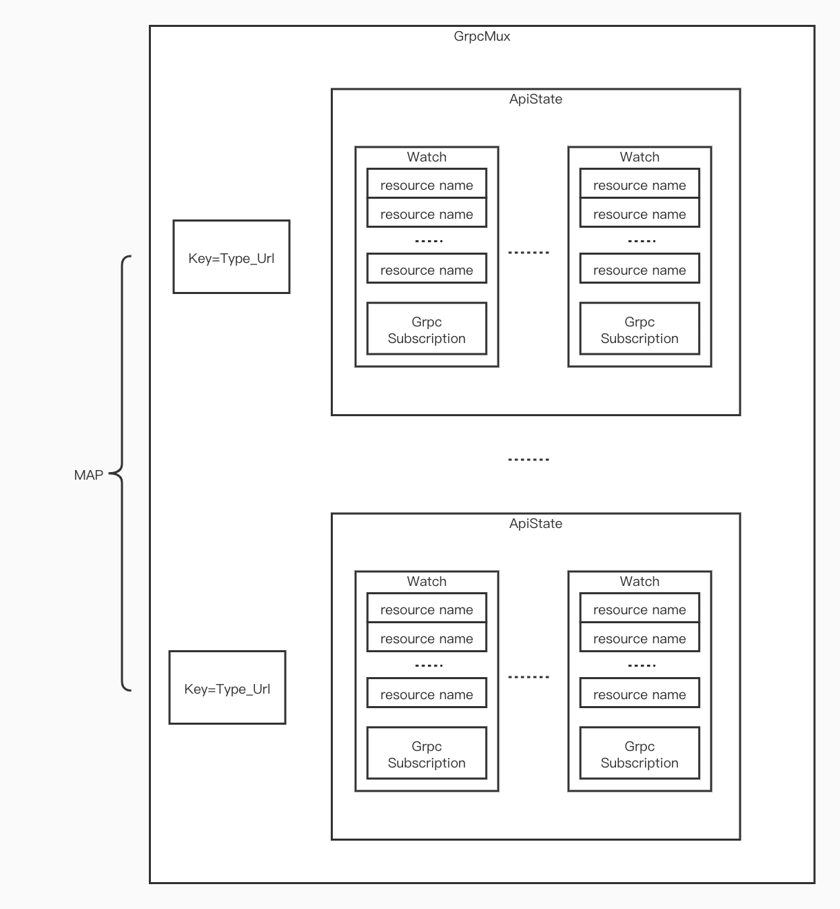

# XDS模块2

本部分以CDS为例，讲解Sotw协议的源码实现。

相应的架构和配置文件可参考

[XDS模块1](./XDS模块(1).md)

[XDS模块2](./XDS模块(2).md)

## 关键类说明

**GrpcStream**

```c++
/* 声明:*/
template <class RequestProto, class ResponseProto>
class GrpcStream : public Grpc::AsyncStreamCallbacks<ResponseProto>

/* 关键属性:*/

// Grpc异步client，用来创建grpc stream
Grpc::AsyncClient<RequestProto, ResponseProto> async_client_;
// Grpc异步client创建的异步stream
Grpc::AsyncStream<RequestProto> stream_{};
// 异步stream的回调函数，收到control plane response后触发
GrpcStreamCallbacks<ResponseProto>* const callbacks_;
// Grpc Server handler的相关信息
const Protobuf::MethodDescriptor& service_method_;

/* 关键接口: */
// 创建新的Stream，成功后会发起DiscoveryRequest
void establishNewStream()
// 发送消息，消息为DiscoveryRequest或DeltaDiscoveryRequest
void sendMessage(const RequestProto& request)
// Stream收到消息，为DiscoveryResponse或DelataDiscoveryResponse
void onReceiveMessage(ResponseProtoPtr<ResponseProto>&& message)

```

**GrpcMuxImpl**

```c++
/* 声明:*/
class GrpcMuxImpl : public GrpcMux,
                    public GrpcStreamCallbacks<envoy::service::discovery::v3::DiscoveryResponse>,
                    public Logger::Loggable<Logger::Id::config>

/* 关键属性:*/
// 创建的GrpcStream实例，用来通信
GrpcStream<envoy::service::discovery::v3::DiscoveryRequest,
envoy::service::discovery::v3::DiscoveryResponse>
grpc_stream_;
// 请求的api的状态，key为api的类型，如cds、eds等
absl::node_hash_map<std::string, ApiState> api_state_;
// 订阅的资源名称，就是type_urls
std::list<std::string> subscriptions_;
// stream对应的发送队列，先进队列再发送
std::unique_ptr<std::queue<std::string>> request_queue_;

/* 关键接口: */
// 添加新的watch，格式见下图
GrpcMuxWatchPtr addWatch(const std::string& type_url, const std::set<std::string>& resources,
SubscriptionCallbacks& callbacks,
OpaqueResourceDecoder& resource_decoder)

// 处理ControlPlane返回的DiscoveryResponse
void
onDiscoveryResponse(std::unique_ptr<envoy::service::discovery::v3::DiscoveryResponse>&& message,
ControlPlaneStats& control_plane_stats)
//执行DiscoveryRequest的发送，消息缓存在ApiState里
void sendDiscoveryRequest(const std::string& type_url);
//将要发送的消息加入发送队列
void queueDiscoveryRequest(const std::string& queue_item);
```

**ApiState**

```c++
/* 声明:*/
struct ApiState

/* 关键属性:*/
// 这个API上所有的Watch
std::list<GrpcMuxWatchImpl*> watches_;
// 当前的DiscoveryRequest，发送时复用
envoy::service::discovery::v3::DiscoveryRequest request_;

/* 关键接口: */

```

**GrpcSubscriptionImpl**

```c++
/* 声明:*/
class GrpcSubscriptionImpl : public Subscription,
                             SubscriptionCallbacks,
                             Logger::Loggable<Logger::Id::config>

/* 关键属性:*/
//所使用的GrpcMux
GrpcMuxSharedPtr grpc_mux_;
//所使用的资源类型
const std::string type_url_;
//下游的Subscription，为XDSApi的Impl
SubscriptionCallbacks& callbacks_;
//所使用watch
GrpcMuxWatchPtr watch_; 

/* 关键接口: */
//配置更新触发的回调，由全量更新的触发
void onConfigUpdate(const std::vector<Config::DecodedResourceRef>& resources,
const std::string& version_info) override;

//配置更新触发的回调，由增量更新的触发
void onConfigUpdate(const std::vector<Config::DecodedResourceRef>& added_resources,
const Protobuf::RepeatedPtrField<std::string>& removed_resources,
const std::string& system_version_info)

//启动并watch这些资源
void start(const std::set<std::string>& resource_names) ;

//变更watch的资源
void updateResourceInterest(const std::set<std::string>& update_to_these_names)

```

**GrpcMuxWatchImpl**

```c++
/* 声明:*/
struct GrpcMuxWatchImpl : public GrpcMuxWatch

/* 关键属性:*/
//订阅的所有资源的name
std::set<std::string> resources_;
//watch callback函数
SubscriptionCallbacks& callbacks_; 一般为GrpcSubscriptionImpl
//resource反序列化
OpaqueResourceDecoder& resource_decoder_;
//资源类型
const std::string type_url_;
//关联的GrpcMux
GrpcMuxImpl& parent_;
//该type api所有的watches
std::list<GrpcMuxWatchImpl*>& watches_;

/* 关键接口: */
// 更新需要watch的资源
void update(const std::set<std::string>& resources)
```

**CdsApiImpl**

```c++
/* 声明:*/
class CdsApiImpl : public CdsApi,
                   Envoy::Config::SubscriptionBase<envoy::config::cluster::v3::Cluster>,
                   Logger::Loggable<Logger::Id::upstream>

/* 关键属性:*/
//集群管理器，最核心的类之一
ClusterManager& cm_;
//GrpcSubscription实例
Config::SubscriptionPtr subscription_;

/* 关键接口: */
//资源更新回调。added_resources包括新增+变更的。removed_resources为删除的资源
void onConfigUpdate(const std::vector<Config::DecodedResourceRef>& added_resources,
const Protobuf::RepeatedPtrField<std::string>& removed_resources,
const std::string& system_version_info) override;
```

从对象的嵌套的角度看，嵌套关系如下图所示：


即一个GrpcMux维护一个Map，key为type_Url, 例如type.googleapis.com/envoy.config.cluster.v3.Cluster，value为对应的ApiState。而ApiState里维护着WatchList，每个Watch维护一组resource name和对应这些资源变更的回调函数。


 | 


|

