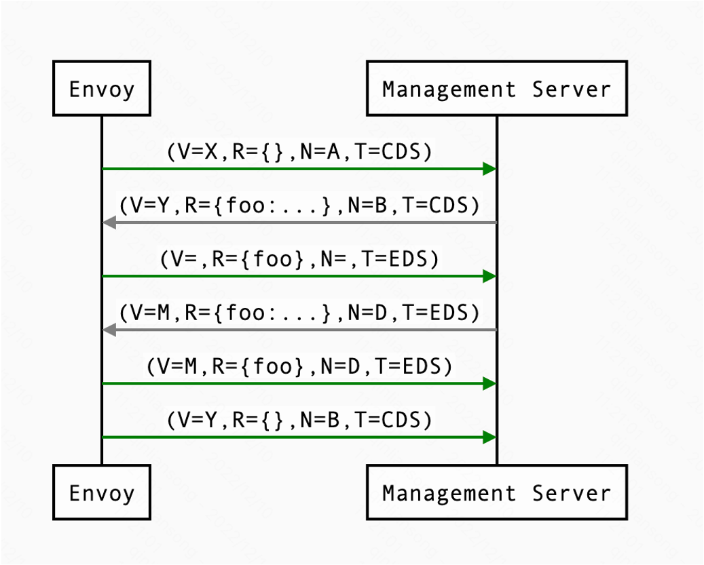
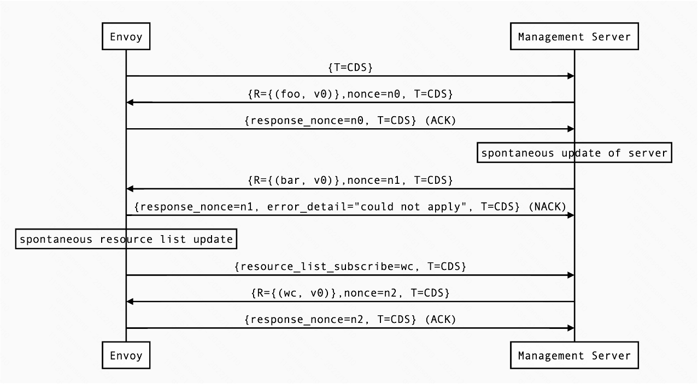
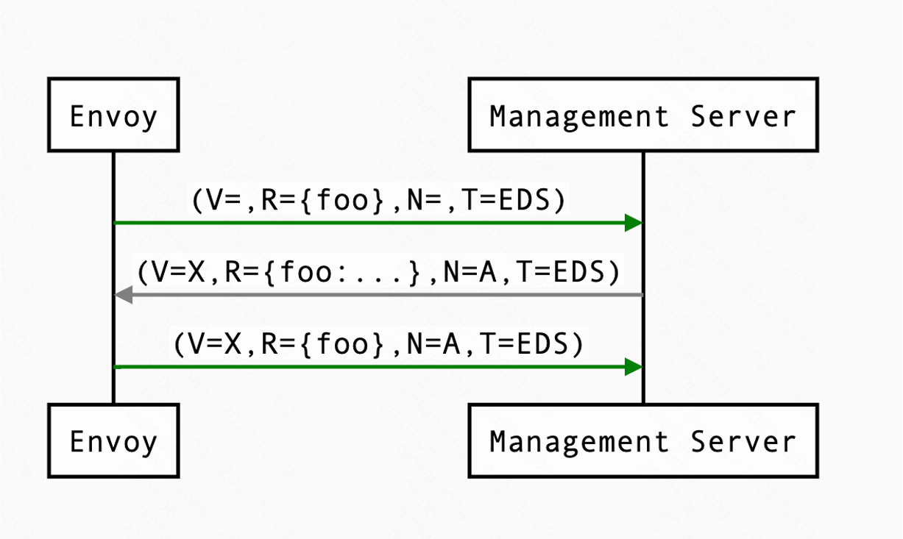
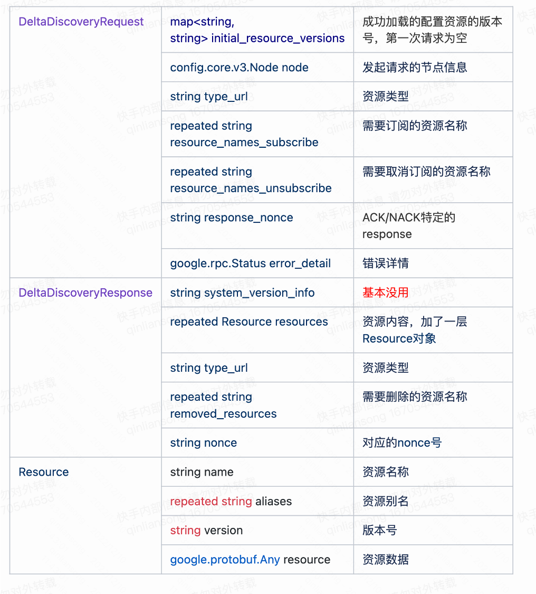
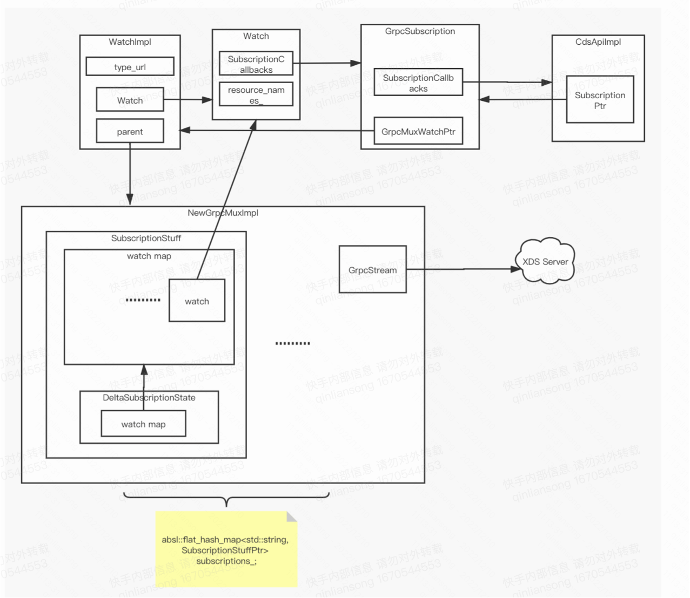
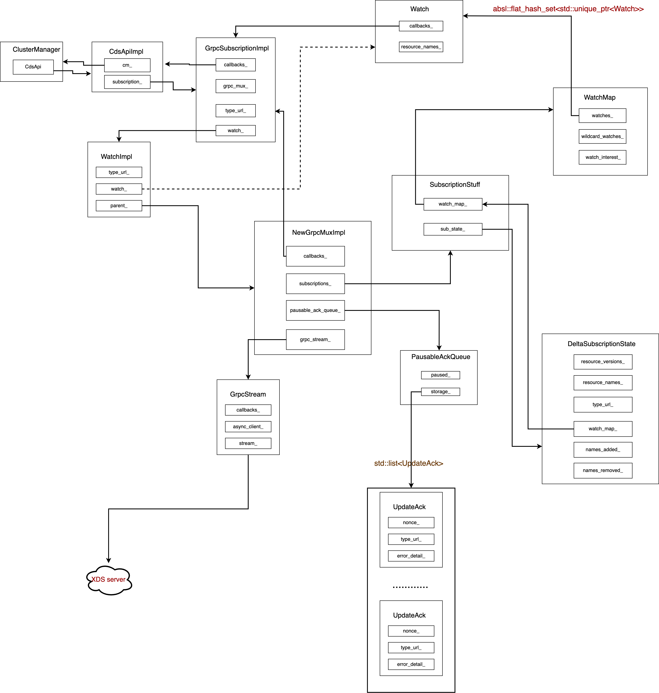

# XDS模块4

本部分主要讲解ADS以及Incremental xDS协议在Envoy中的实现相关的源码分析。

## ADS(Aggregated Discovery Service)

ADS满足如下条件：
- server端必须为单个管理服务器

- client端通过单个gRPC流传递所有API request。

对于ADS，单个流可以传递多个资源类型的DiscoveryRequest/DiscoveryResponse用。对于任何给定类型的URL，上述DiscoveryRequest和DiscoveryResponse消息的顺序都适用。更新序列示例如下：

上图便是同一个grpc stream发送多个type url资源的request/response时序图

## Incremental xDS

- 允许协议根据资源/资源名称增量（“Delta xDS”）进行通信。 这保证了 xDS 资源的可扩展性目标。 管理服务器只需要交付变更的单个集群，而不是在变更单个集群时交付所有 100k 集群。

- 允许 Envoy 按需/懒惰地请求额外的资源。 例如，仅当对该集群的请求到达时才请求该集群。

增量 xDS 会话始终在 gRPC 双向流的上下文中。 这允许 xDS 服务器跟踪连接到它的 xDS 客户端的状态。 目前还没有增量 xDS 的 REST 版本。

在 delta xDS协议中，nonce 字段是必需的，用于将 [DeltaDiscoveryResponse](https://www.envoyproxy.io/docs/envoy/latest/api-v3/service/discovery/v3/discovery.proto#envoy-v3-api-msg-service-discovery-v3-deltadiscoveryrequest) 与 [DeltaDiscoveryRequest](https://www.envoyproxy.io/docs/envoy/latest/api-v3/service/discovery/v3/discovery.proto#envoy-v3-api-msg-service-discovery-v3-deltadiscoveryrequest) ACK 或 NACK 配对。 可选地，response中的 system_version_info 仅用于调试目的。

[DeltaDiscoveryRequest](https://www.envoyproxy.io/docs/envoy/latest/api-v3/service/discovery/v3/discovery.proto#envoy-v3-api-msg-service-discovery-v3-deltadiscoveryrequest)可以在以下情况发送

- xDS 双向 gRPC stream的初始消息

- 作为对先前 DeltaDiscoveryResponse 的 ACK 或 NACK 响应。 在这种情况下，response_nonce 被设置为 Response 中的 nonce 值。 ACK 或 NACK 由 error_detail 的存在与否决定。

- 来自客户端的自发 DeltaDiscoveryRequests。 可以这样做以从跟踪的 resource_names 集中动态添加或删除元素。 在这种情况下，必须省略 response_nonce。

**虽然可以在请求上设置 response_nonce，但即使随机数已过时，服务器也必须接受订阅状态的更改。 nonce 可用于将 ack/nack 与服务器响应相关联，但服务器不应用于拒绝过时的请求。**

在如下示例中，客户端连接并接收它确认的第一个更新。 第二次更新失败，客户端 NACKs 更新。 随后 xDS 客户端自发地请求“wc”资源。

在重新连接时，增量 xDS 客户端可以通过在 initial_resource_versions 中记录其已知资源 来告诉服务器，避免通过网络重新发送它们。 因为以前的grpc stream是无状态的，所以重新连接的客户端必须向服务器提供它感兴趣的所有资源名称。

其交互形式如下所示

## DeltaDiscoveryResponse/DeltaDiscoveryRequest介绍

## ADS整体架构

本小节给出envoy中ADS模块所涉及的各个组件之间的交互关系，

一个简略版的对象间的交互关系如下所示

一个更详细的对象间的交互关系如下所示

## 总结

本文主要介绍了envoy中ADS以及增量协议的实现原理，和相应的envoy中所涉及的各组件之间的依赖关系。

下一小节会基于CDS讲解Envoy中关于ADS的源码实现。

