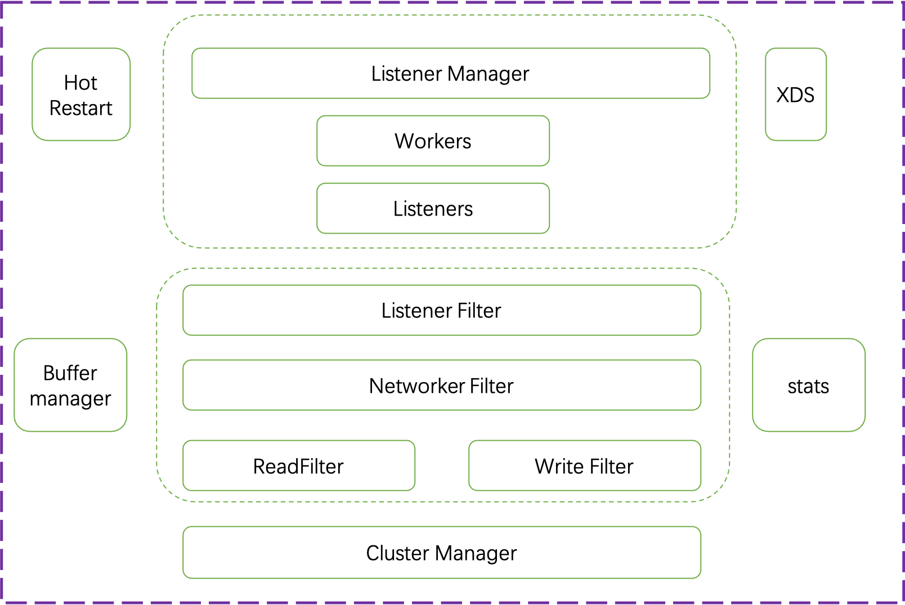

# envoy 架构简介

envoy的一个简略架构如下

如上图所示，envoy主要的模块为：

- Listener Manager

- Cluster Manager

以及相应的辅助模块，譬如：

- stats 系统

- 热重启模块

- XDS模块

- buffer 管理

- libevent模块

- 线程模型

最新的envoy版本还引入了

- wasm

- ebpf

- io_uring

等模块

