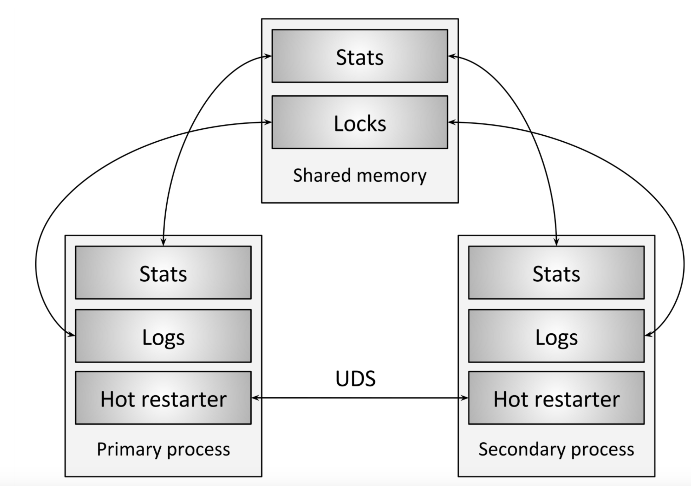

# envoy热重启(1)

## 概念

热重启是一种服务部署方式，服务的另一种部署方式为滚动升级。

其升级部署形式如下：


通过在同一台机器上，将一个服务切换到新服务，而不会造成任何流量损失。

## envoy采用热重启的背景

热重启是简单的和容易实现的，目前仍然是被很多组织采用。

envoy基于热重启又增加了些许设计目标：

a. 整个进程(不仅仅包含配置文件）能够在不损失任何流量的情况下被加载

b. 在重启期间envoy的统计信息应该保持一致

c. 基于容器的不可变的部署仍然可以采用热重启部署envoy

d. 旧的envoy服务的排水率和死亡速率应该是可控的

## envoy热重启的原理以及工作方式

envoy热重启架构如下所示



热重启架构主要由四部分组成：主进程，共享内存，unix域套接字(UDS), 以及部署进程(需要部署升级的服务）

共享内存：包含版本信息，原始统计信息存储，以及共享锁，其在envoy中的实现如下：

```c++

struct SharedMemory {
  uint64_t size_;
  uint64_t version_;
  pthread_mutex_t log_lock_;
  pthread_mutex_t access_log_lock_;
  std::atomic<uint64_t> flags_;
```

主进程：

这是你的旧envoy服务，当该进程排水结束后部署进程便变成主进程，主进程在envoy中定义为：

```c++
class HotRestartingParent
```

部署进程：

这个是你需要部署的新的envoy进程，最终这个会变成主进程，子进程在envoy中定义为

```c++
class HotRestartingChild
```

unix域套接字：

主进程和子进程间通过一个简单的rpc通信，该通信通过unix域套接字实现。

热重启工作过程


上图各部分解释如下：

（1）从进程要求主进程关闭其admin端口。从进程现在接管所有admin的功能，包括统计信息刷新。这样，从操作的角度来看，逻辑上只有一个envoy进程。

（2）从进程加载其配置，开始绑定监听套接字。在此阶段，从进程通过UDS从主进程取回适用的侦听套接字。

（3）从进程通过UDS取回stats。

（4）从进程完全初始化后，会向主进程发送请求，要求主进程停止侦听套接字并开始drain。drain的时间是可配置的，一般默认为15min。在这15分钟内(或者配置的时间内）主进程将开始正常关闭连接。该过程越长，关闭的连接越多。这样可以平滑关闭连接，并在从进程上重新建立连接。

（5）drain完成后，从进程告诉主进程shut down。 主进程保持打开的所有剩余连接都将关闭。 此时从进程变为主进程。

**注： 在（3）结束后（4）开始前，从进程会调用evconnlistener_new()函数创建网络listener并由此开始创建新连接**

## 热重启使用

可以通过手动或者包装器进行热重启。

主要可参考：[Envoy 热重启实践 - 掘金](https://juejin.cn/post/6844903769486917646)

手动部署可以用：
```c++
--restart-epoch 
```

包装器热重启需要用到

**restart/hot_restart.py工具**

## 总结

本文主要是翻译了大佬的博客所得，envoy中热重启的部分实现有所改变，其改变部分会在下一篇源码讲解中进一步描述。