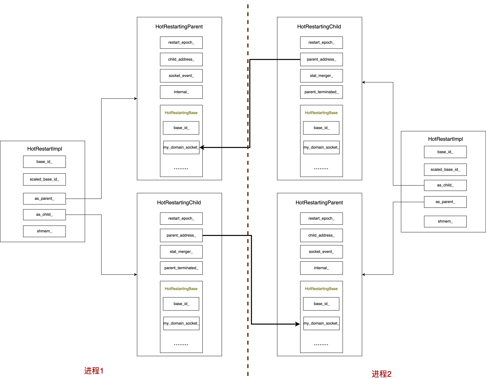

# envoy热重启(2)

本文主要讲解Envoy中热重启的实现。

## 整体架构

在理解Envoy中热重启的源码实现时，需要从两个进程的视角进行梳理，也即如下架构



对于上图解释如下

Envoy中热重启实现主要涉及如下类
```c++
class HotRestartImpl : public HotRestart;

class HotRestartingParent;

class HotRestartingChild;

class HotRestartingBase
```

其中

- HotRestartingParent负责在进程1中的热重启逻辑处理

- HotRestartingChild负责在进程2中的热重启逻辑处理

## 初始化

Envoy中热重启的抽象为HotRestartImpl,其初始化入口位于source/exe/main_common.cc中的MainCommonBase::MainCommonBase构造函数中的如下实现
```c++
switch (options_.mode()) {
  case Server::Mode::InitOnly:
  case Server::Mode::Serve: {
    configureHotRestarter(*random_generator);
```

上述configureHotRestarter函数如下

```c++
void MainCommonBase::configureHotRestarter(Runtime::RandomGenerator& random_generator) {
#ifdef ENVOY_HOT_RESTART
  if (!options_.hotRestartDisabled()) {
    uint32_t base_id = options_.baseId();

    if (options_.useDynamicBaseId()) {
      ASSERT(options_.restartEpoch() == 0, "cannot use dynamic base id during hot restart");

      std::unique_ptr<Server::HotRestart> restarter;

      // Try 100 times to get an unused base ID and then give up under the assumption
      // that some other problem has occurred to prevent binding the domain socket.
      for (int i = 0; i < 100 && restarter == nullptr; i++) {
        // HotRestartImpl is going to multiply this value by 10, so leave head room.
        base_id = static_cast<uint32_t>(random_generator.random()) & 0x0FFFFFFF;

        try {
          restarter = std::make_unique<Server::HotRestartImpl>(base_id, 0);
        } catch (Server::HotRestartDomainSocketInUseException& ex) {
          // No luck, try again.
          ENVOY_LOG_MISC(debug, "dynamic base id: {}", ex.what());
        }
      }

      if (restarter == nullptr) {
        throw EnvoyException("unable to select a dynamic base id");
      }

      restarter_.swap(restarter);
    } else {
      restarter_ = std::make_unique<Server::HotRestartImpl>(base_id, options_.restartEpoch());
    }

    // Write the base-id to the requested path whether we selected it
    // dynamically or not.
    if (!options_.baseIdPath().empty()) {
      std::ofstream base_id_out_file(options_.baseIdPath());
      if (!base_id_out_file) {
        ENVOY_LOG_MISC(critical, "cannot open base id output file {} for writing.",
                       options_.baseIdPath());
      } else {
        base_id_out_file << base_id;
      }
    }
  }
#else
  UNREFERENCED_PARAMETER(random_generator);
#endif

  if (restarter_ == nullptr) {
    restarter_ = std::make_unique<Server::HotRestartNopImpl>();
  }
}

```

**上述需要说明的是若要使用动态base id功能，则不会触发envoy的热重启。**
本文主要讲解会触发envoy热重启的初始化，也即上述如下语句
```c++
restarter_ = std::make_unique<Server::HotRestartImpl>(base_id, options_.restartEpoch());
```
上述会调用位于source/server/hot_restart_impl.h的Server::HotRestartImpl的构造函数进行初始化,其实现如下
```c++
HotRestartImpl::HotRestartImpl(uint32_t base_id, uint32_t restart_epoch)
    : base_id_(base_id), scaled_base_id_(base_id * 10),
      as_child_(HotRestartingChild(scaled_base_id_, restart_epoch)),
      as_parent_(HotRestartingParent(scaled_base_id_, restart_epoch)),
      shmem_(attachSharedMemory(scaled_base_id_, restart_epoch)), log_lock_(shmem_->log_lock_),
      access_log_lock_(shmem_->access_log_lock_) {
  // If our parent ever goes away just terminate us so that we don't have to rely on ops/launching
  // logic killing the entire process tree. We should never exist without our parent.
  int rc = prctl(PR_SET_PDEATHSIG, SIGTERM);
  RELEASE_ASSERT(rc != -1, "");
}
```
上述需要作如下说明：

**base_id_:** 可以理解为envoy的热重启的基线，不同的base_id代表不同的envoy进程

**as_child_:** 也即HotRestartingChild类型的实例，用来同上一个进程进行热重启之间的通信组件

**as_parent_:** 也即HotRestartingParent类型的实例，用来同热重启的进程2通信的组件

**shmem_:** 共享内存，用来保存和共享envoy版本相关的信息

- as_child_初始化
-----------------------------------------------------

起构造函数位于source/server/hot_restarting_child.h，其实现如下
```c++
HotRestartingChild::HotRestartingChild(int base_id, int restart_epoch)
    : HotRestartingBase(base_id), restart_epoch_(restart_epoch) {
  initDomainSocketAddress(&parent_address_);
  if (restart_epoch_ != 0) {
    parent_address_ = createDomainSocketAddress(restart_epoch_ + -1, "parent");
  }
  bindDomainSocket(restart_epoch_, "child");
}
```
HotRestartingChild的父类为HotRestartingBase,其中主要是初始化UDS相关的公共逻辑。

在该构造函数中，可以得出如下结论：

**若restart_epoch为0，则不会进行热重启，因为restart_epoch为0代表的是第一个进程**

下面以restart_epoch不为0的场景来说明HotRestartingChild的初始化

**Note: 在理解HotRestartingChild的初始化时，需要将视角固定在进程2，其正在进行热重启**

在HotRestartingChild的构造函数中首先调用位于source/server/hot_restarting_base.cc的HotRestartingBase::initDomainSocketAddress函数初始化其上一个进程的parent_address_,也即上一个进程的uds socket的地址.

其实现较为简单，本文不列出讲解。

然后会调用位于source/server/hot_restarting_base.cc的HotRestartingBase::createDomainSocketAddress函数创建相应的parent_address_, 其实现如下

```c++
sockaddr_un HotRestartingBase::createDomainSocketAddress(uint64_t id, const std::string& role) {
  // Right now we only allow a maximum of 3 concurrent envoy processes to be running. When the third
  // starts up it will kill the oldest parent.
  static constexpr uint64_t MaxConcurrentProcesses = 3;
  id = id % MaxConcurrentProcesses;

  // This creates an anonymous domain socket name (where the first byte of the name of \0).
  sockaddr_un address;
  initDomainSocketAddress(&address);
  StringUtil::strlcpy(&address.sun_path[1],
                      fmt::format("envoy_domain_socket_{}_{}", role, base_id_ + id).c_str(),
                      sizeof(address.sun_path) - 1);
  address.sun_path[0] = 0;
  return address;
}
```

该函数可以总结出

- 对于每一个base_id，热重启时最多允许同时存在3个进程

- 进程1的uds socket的地址是base_id + id以及role构成，其中role为parent， base_id进程1和进程2相同，id为传入的参数，为restart_epoch - 1

此后，会调用位于source/server/hot_restarting_base.cc的HotRestartingBase::bindDomainSocket函数，创建本进程的uds socket并进行bind操作，其实现如下

```c++
void HotRestartingBase::bindDomainSocket(uint64_t id, const std::string& role) {
  Api::OsSysCalls& os_sys_calls = Api::OsSysCallsSingleton::get();
  // This actually creates the socket and binds it. We use the socket in datagram mode so we can
  // easily read single messages.
  my_domain_socket_ = socket(AF_UNIX, SOCK_DGRAM | SOCK_NONBLOCK, 0);
  sockaddr_un address = createDomainSocketAddress(id, role);
  Api::SysCallIntResult result =
      os_sys_calls.bind(my_domain_socket_, reinterpret_cast<sockaddr*>(&address), sizeof(address));
  if (result.rc_ != 0) {
    const auto msg = fmt::format(
        "unable to bind domain socket with base_id={}, id={}, errno={} (see --base-id option)",
        base_id_, id, result.errno_);
    if (result.errno_ == SOCKET_ERROR_ADDR_IN_USE) {
      throw HotRestartDomainSocketInUseException(msg);
    }
    throw EnvoyException(msg);
  }
}
```
上述函数的主要任务便是创建进程2的uds socket，将其uds的path设置为base_id + restart_epoch 和id为child。

并调用bind对相应的uds进行绑定。

至此，HotRestartingChild的初始化完成。

-----------------------------------------------------

- as_parent_初始化

-----------------------------------------------------

会调用位于source/server/hot_restarting_parent.h的HotRestartingParent::HotRestartingParent构造函数对其进行初始化，其实现如下

```c++
HotRestartingParent::HotRestartingParent(int base_id, int restart_epoch)
    : HotRestartingBase(base_id), restart_epoch_(restart_epoch) {
  child_address_ = createDomainSocketAddress(restart_epoch_ + 1, "child");
  bindDomainSocket(restart_epoch_, "parent");
}
```
该构造函数需要从进程1的视角来看，此时若要启动热重启，则进程2的restart_epoch为进程1的restart_epoch+1；

也即上述调用createDomainSocketAddress函数传入的参数，此时child_address_的uds path同进程2的uds的path相同。

上述bindDomainSocket函数的功能在初始化HotRestartingChild中已经讲过，此处不在赘述。

至此，HotRestartingParent初始化完成

----------------------------------------------------

- shmem_初始化

-----------------------------------------------
其初始化有位于source/server/hot_restart_impl.cc的attachSharedMemory函数完成，其具体实现如下所示
```c++
SharedMemory* attachSharedMemory(uint32_t base_id, uint32_t restart_epoch) {
  Api::OsSysCalls& os_sys_calls = Api::OsSysCallsSingleton::get();
  Api::HotRestartOsSysCalls& hot_restart_os_sys_calls = Api::HotRestartOsSysCallsSingleton::get();

  int flags = O_RDWR;
  const std::string shmem_name = fmt::format("/envoy_shared_memory_{}", base_id);
  if (restart_epoch == 0) {
    flags |= O_CREAT | O_EXCL;

    // If we are meant to be first, attempt to unlink a previous shared memory instance. If this
    // is a clean restart this should then allow the shm_open() call below to succeed.
    hot_restart_os_sys_calls.shmUnlink(shmem_name.c_str());
  }

  const Api::SysCallIntResult result =
      hot_restart_os_sys_calls.shmOpen(shmem_name.c_str(), flags, S_IRUSR | S_IWUSR);
  if (result.rc_ == -1) {
    PANIC(fmt::format("cannot open shared memory region {} check user permissions. Error: {}",
                      shmem_name, errorDetails(result.errno_)));
  }

  if (restart_epoch == 0) {
    const Api::SysCallIntResult truncateRes =
        os_sys_calls.ftruncate(result.rc_, sizeof(SharedMemory));
    RELEASE_ASSERT(truncateRes.rc_ != -1, "");
  }

  const Api::SysCallPtrResult mmapRes = os_sys_calls.mmap(
      nullptr, sizeof(SharedMemory), PROT_READ | PROT_WRITE, MAP_SHARED, result.rc_, 0);
  SharedMemory* shmem = reinterpret_cast<SharedMemory*>(mmapRes.rc_);
  RELEASE_ASSERT(shmem != MAP_FAILED, "");
  RELEASE_ASSERT((reinterpret_cast<uintptr_t>(shmem) % alignof(decltype(shmem))) == 0, "");

  if (restart_epoch == 0) {
    shmem->size_ = sizeof(SharedMemory);
    shmem->version_ = HOT_RESTART_VERSION;
    initializeMutex(shmem->log_lock_);
    initializeMutex(shmem->access_log_lock_);
  } else {
    RELEASE_ASSERT(shmem->size_ == sizeof(SharedMemory),
                   "Hot restart SharedMemory size mismatch! You must have hot restarted into a "
                   "not-hot-restart-compatible new version of Envoy.");
    RELEASE_ASSERT(shmem->version_ == HOT_RESTART_VERSION,
                   "Hot restart version mismatch! You must have hot restarted into a "
                   "not-hot-restart-compatible new version of Envoy.");
  }

  // Here we catch the case where a new Envoy starts up when the current Envoy has not yet fully
  // initialized. The startup logic is quite complicated, and it's not worth trying to handle this
  // in a finer way. This will cause the startup to fail with an error code early, without
  // affecting any currently running processes. The process runner should try again later with some
  // back off and with the same hot restart epoch number.
  uint64_t old_flags = shmem->flags_.fetch_or(SHMEM_FLAGS_INITIALIZING);
  if (old_flags & SHMEM_FLAGS_INITIALIZING) {
    throw EnvoyException("previous envoy process is still initializing");
  }
  return shmem;
}
```

Envoy中创建共享内存的实现，其主要是利用posix标准提供的创建共享内存的接口，具体关于shmOpen等相关的解释可参考:
[shm_open](https://man7.org/linux/man-pages/man3/shm_open.3.html)

上述需要注意

- 共享内存的文件名同base_id绑定

- 若果restart_epoch为0，则会将flag设置O_EXCL选项，并且调用shm_unlink关闭已经生成的共享内存

- 如果restart_epoch不为0，则此时shm_open能正常返回

- restart_epoch为0时，会清空共享内存的内容

- 最后调用mmap将共享内存真正绑定

-----------------------------------------------

至此，Envoy中共享内存的初始化完成。

## 热重启工作流程

理解热重启在envoy中是如何工作的，依然需要从两个进程的视角来分析相应的源码，也即文章开始的**进程1** 和 **进程2**。其中 **进程2**为重新启动的进程，也即热重启的进程。在其HotRestartImpl实例初始化完成后，在位于source/server/server.cc的InstanceImpl::InstanceImpl构造函数中，有如下实现

```c++
restarter_.initialize(*dispatcher_, *this);
```

上述会调用位于source/server/hot_restart_impl.cc的HotRestartImpl::initialize函数，其会调用位于source/server/hot_restarting_parent.cc的HotRestartingParent::initialize函数，其实现如下

```c++
void HotRestartingParent::initialize(Event::Dispatcher& dispatcher, Server::Instance& server) {
  socket_event_ = dispatcher.createFileEvent(
      myDomainSocket(),
      [this](uint32_t events) -> void {
        ASSERT(events == Event::FileReadyType::Read);
        onSocketEvent();
      },
      Event::FileTriggerType::Edge, Event::FileReadyType::Read);
  internal_ = std::make_unique<Internal>(&server);
}
```
上述会初始化socket_event_成员变量. 理解此代码需要转换到**进程1**的视角，在**进程1**中，该部分会初始化HotRestartingParent的socket_event_, 其通过dispatcher的createFileEvent函数初始化，关于dispatcher以及相应的event会放到下部分讲解。

socket_event_的作用：监听**进程1**的uds，当其上有数据可读时，调用相应的HotRestartingParent::onSocketEvent()函数。

相应的热重启逻辑均在该函数中，其实现如下所示
```c++
void HotRestartingParent::onSocketEvent() {
  std::unique_ptr<HotRestartMessage> wrapped_request;
  while ((wrapped_request = receiveHotRestartMessage(Blocking::No))) {
    if (wrapped_request->requestreply_case() == HotRestartMessage::kReply) {
      ENVOY_LOG(error, "child sent us a HotRestartMessage reply (we want requests); ignoring.");
      HotRestartMessage wrapped_reply;
      wrapped_reply.set_didnt_recognize_your_last_message(true);
      sendHotRestartMessage(child_address_, wrapped_reply);
      continue;
    }
    switch (wrapped_request->request().request_case()) {
    case HotRestartMessage::Request::kShutdownAdmin: {
      sendHotRestartMessage(child_address_, internal_->shutdownAdmin());
      break;
    }

    case HotRestartMessage::Request::kPassListenSocket: {
      sendHotRestartMessage(child_address_,
                            internal_->getListenSocketsForChild(wrapped_request->request()));
      break;
    }

    case HotRestartMessage::Request::kStats: {
      HotRestartMessage wrapped_reply;
      internal_->exportStatsToChild(wrapped_reply.mutable_reply()->mutable_stats());
      sendHotRestartMessage(child_address_, wrapped_reply);
      break;
    }

    case HotRestartMessage::Request::kDrainListeners: {
      internal_->drainListeners();
      break;
    }

    case HotRestartMessage::Request::kTerminate: {
      ENVOY_LOG(info, "shutting down due to child request");
      kill(getpid(), SIGTERM);
      break;
    }

    default: {
      ENVOY_LOG(error, "child sent us an unfamiliar type of HotRestartMessage; ignoring.");
      HotRestartMessage wrapped_reply;
      wrapped_reply.set_didnt_recognize_your_last_message(true);
      sendHotRestartMessage(child_address_, wrapped_reply);
      break;
    }
    }
  }
}

```
关于该函数的实现内容，在后续**进程1**，**进程2**的热重启交互中进行相应分析。

在HotRestartImpl::initialize完成后，在source/server/server.cc的InstanceImpl::initialize的函数中会有如下实现

```c++
// Learn original_start_time_ if our parent is still around to inform us of it.
  restarter_.sendParentAdminShutdownRequest(original_start_time_);
```

此刻需要以**进程2**的视角来看该语句，上述会调用HotRestartImpl::sendParentAdminShutdownRequest函数，其实现如下
```c++
void HotRestartImpl::sendParentAdminShutdownRequest(time_t& original_start_time) {
  as_child_.sendParentAdminShutdownRequest(original_start_time);
}
```
上述会调用位于source/server/hot_restarting_child.cc的HotRestartingChild::sendParentAdminShutdownRequest函数，
其实现如下

```c++
void HotRestartingChild::sendParentAdminShutdownRequest(time_t& original_start_time) {
  if (restart_epoch_ == 0 || parent_terminated_) {
    return;
  }

  HotRestartMessage wrapped_request;
  wrapped_request.mutable_request()->mutable_shutdown_admin();
  sendHotRestartMessage(parent_address_, wrapped_request);

  std::unique_ptr<HotRestartMessage> wrapped_reply = receiveHotRestartMessage(Blocking::Yes);
  RELEASE_ASSERT(replyIsExpectedType(wrapped_reply.get(), HotRestartMessage::Reply::kShutdownAdmin),
                 "Hot restart parent did not respond as expected to ShutdownParentAdmin.");
  original_start_time = wrapped_reply->reply().shutdown_admin().original_start_time_unix_seconds();
}

```

上述函数实现如下功能：

- 若进程2为第一个进程，或者进程1已经终止，则不发送request

- 调用sendHotRestartMessage函数，向进程1发送shut down admin消息

- 调用receiveHotRestartMessage函数，解析进程1的reply 

sendHotRestartMessage函数实现如下

```c++
void HotRestartingBase::sendHotRestartMessage(sockaddr_un& address,
                                              const HotRestartMessage& proto) {
  const uint64_t serialized_size = proto.ByteSizeLong();
  const uint64_t total_size = sizeof(uint64_t) + serialized_size;
  // Fill with uint64_t 'length' followed by the serialized HotRestartMessage.
  std::vector<uint8_t> send_buf;
  send_buf.resize(total_size);
  *reinterpret_cast<uint64_t*>(send_buf.data()) = htobe64(serialized_size);
  RELEASE_ASSERT(proto.SerializeWithCachedSizesToArray(send_buf.data() + sizeof(uint64_t)),
                 "failed to serialize a HotRestartMessage");

  RELEASE_ASSERT(fcntl(my_domain_socket_, F_SETFL, 0) != -1,
                 fmt::format("Set domain socket blocking failed, errno = {}", errno));

  uint8_t* next_byte_to_send = send_buf.data();
  uint64_t sent = 0;
  while (sent < total_size) {
    const uint64_t cur_chunk_size = std::min(MaxSendmsgSize, total_size - sent);
    iovec iov[1];
    iov[0].iov_base = next_byte_to_send;
    iov[0].iov_len = cur_chunk_size;
    next_byte_to_send += cur_chunk_size;
    sent += cur_chunk_size;
    msghdr message;
    memset(&message, 0, sizeof(message));
    message.msg_name = &address;
    message.msg_namelen = sizeof(address);
    message.msg_iov = iov;
    message.msg_iovlen = 1;

    // Control data stuff, only relevant for the fd passing done with PassListenSocketReply.
    uint8_t control_buffer[CMSG_SPACE(sizeof(int))];
    if (replyIsExpectedType(&proto, HotRestartMessage::Reply::kPassListenSocket) &&
        proto.reply().pass_listen_socket().fd() != -1) {
      memset(control_buffer, 0, CMSG_SPACE(sizeof(int)));
      message.msg_control = control_buffer;
      message.msg_controllen = CMSG_SPACE(sizeof(int));
      cmsghdr* control_message = CMSG_FIRSTHDR(&message);
      control_message->cmsg_level = SOL_SOCKET;
      control_message->cmsg_type = SCM_RIGHTS;
      control_message->cmsg_len = CMSG_LEN(sizeof(int));
      *reinterpret_cast<int*>(CMSG_DATA(control_message)) = proto.reply().pass_listen_socket().fd();
      ASSERT(sent == total_size, "an fd passing message was too long for one sendmsg().");
    }

    const int rc = sendmsg(my_domain_socket_, &message, 0);
    RELEASE_ASSERT(rc == static_cast<int>(cur_chunk_size),
                   fmt::format("hot restart sendmsg() failed: returned {}, errno {}", rc, errno));
  }
  RELEASE_ASSERT(fcntl(my_domain_socket_, F_SETFL, O_NONBLOCK) != -1,
                 fmt::format("Set domain socket nonblocking failed, errno = {}", errno));
}

```

该函数工作流程如下

- 初始化发送buf

- fcntl(my_domain_socket_, F_SETFL, 0),设置进程2的uds 为block

- 通过uds发送相关的msg，其中若message为PassListenSocketReply，则设置相应的control msg，关于uds相关控制msg的解释可参考:[cmsg_space](https://linux.die.net/man/3/cmsg_space) 以及 [Understanding the msghdr structure from sys/socket.h](https://stackoverflow.com/questions/32593697/understanding-the-msghdr-structure-from-sys-socket-h)

- 调用sendmsg向进程1发送msg

- fcntl(my_domain_socket_, F_SETFL, O_NONBLOCK) 将进程2的uds设置为非block

关于receiveHotRestartMessage(Blocking::Yes)函数的讲解，本文不再赘述。

当进程2通过uds发送消息后，来看看进程1是如何处理相应的逻辑的。

此时进程1会调用HotRestartingParent::onSocketEvent()函数，在该函数中走到如下语句
```c++
switch (wrapped_request->request().request_case()) {
    case HotRestartMessage::Request::kShutdownAdmin: {
      sendHotRestartMessage(child_address_, internal_->shutdownAdmin());
      break;
    }
```
也即此时进程1通过解析进程2发送的request的类型知道此request是要求进程1 关闭其admin接口，故上述会首先调用位于source/server/hot_restarting_parent.cc的HotRestartingParent::Internal::shutdownAdmin()函数，其实现如下
```c++
HotRestartMessage HotRestartingParent::Internal::shutdownAdmin() {
  server_->shutdownAdmin();
  HotRestartMessage wrapped_reply;
  wrapped_reply.mutable_reply()->mutable_shutdown_admin()->set_original_start_time_unix_seconds(
      server_->startTimeFirstEpoch());
  return wrapped_reply;
}
```
该函数会调用位于source/server/server.cc的InstanceImpl::shutdownAdmin()函数，其中会重置flush_stats_timer,以及关闭相应的admin, 具体讲解会在后续部分讲解连接关闭相关的源码分析。

然后该函数会将进程1的启动至此的时间转换成unix时间戳发送给进程2.

至此，第一轮交互完成。

**关于传递Stats和shutdown 请求的交互流程本文不再讲解。下面来看一下Envoy中热重启如何传递listen fd的流程。**

这部分逻辑涉及到Listener初始化以及Socket初始化部分，本部分会在后续讲解，本文主要讲解热重启如何获得进程1的listen fd的。该部分逻辑入口位于source/server/listener_manager_impl.cc中的ProdListenerComponentFactory::createListenSocket函数，其有部分如下实现
```c++
    const int fd = server_.hotRestart().duplicateParentListenSocket(addr);
```

理解上述逻辑需要先从进程2的视角出发，上述会调用位于source/server/hot_restart_impl.cc的HotRestartImpl::duplicateParentListenSocket函数，其会调用位于source/server/hot_restarting_child.cc的 HotRestartingChild::duplicateParentListenSocket函数，该函数实现如下
```c++
int HotRestartingChild::duplicateParentListenSocket(const std::string& address) {
  if (restart_epoch_ == 0 || parent_terminated_) {
    return -1;
  }

  HotRestartMessage wrapped_request;
  wrapped_request.mutable_request()->mutable_pass_listen_socket()->set_address(address);
  sendHotRestartMessage(parent_address_, wrapped_request);

  std::unique_ptr<HotRestartMessage> wrapped_reply = receiveHotRestartMessage(Blocking::Yes);
  if (!replyIsExpectedType(wrapped_reply.get(), HotRestartMessage::Reply::kPassListenSocket)) {
    return -1;
  }
  return wrapped_reply->reply().pass_listen_socket().fd();
}
```
相关逻辑可参考热重启第一次交互相关源码讲解，此处不在赘述。

当进程2发送request成功后，进程1会调用 HotRestartingParent::onSocketEvent()函数，执行如下部分代码
```c++
case HotRestartMessage::Request::kPassListenSocket: {
      sendHotRestartMessage(child_address_,
                            internal_->getListenSocketsForChild(wrapped_request->request()));
      break;
    }
```
上述会先调用HotRestartingParent::Internal::getListenSocketsForChild函数，其实现如下所示
```c++
HotRestartMessage
HotRestartingParent::Internal::getListenSocketsForChild(const HotRestartMessage::Request& request) {
  HotRestartMessage wrapped_reply;
  wrapped_reply.mutable_reply()->mutable_pass_listen_socket()->set_fd(-1);
  Network::Address::InstanceConstSharedPtr addr =
      Network::Utility::resolveUrl(request.pass_listen_socket().address());
  for (const auto& listener : server_->listenerManager().listeners()) {
    Network::ListenSocketFactory& socket_factory = listener.get().listenSocketFactory();
    if (*socket_factory.localAddress() == *addr && listener.get().bindToPort()) {
      if (socket_factory.sharedSocket().has_value()) {
        // Pass the socket to the new process iff it is already shared across workers.
        wrapped_reply.mutable_reply()->mutable_pass_listen_socket()->set_fd(
            socket_factory.sharedSocket()->get().ioHandle().fd());
      }
      break;
    }
  }
  return wrapped_reply;
}
```
**在envoy中，能够在热重启中传递的fd必须为非reuse_port的fd**。

关于该部分的讲解，会在讲解完listener初始化后补全。

## 总结

本文针对envoy中热重启的源码实现进行了相应的分析。


