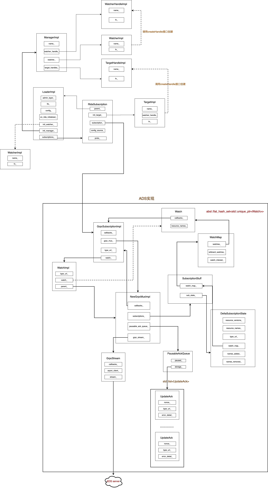

# rtds模块

本文主要讲解envoy中rtds相关的实现。

本文讲解基于如下配置
```c++
layered_runtime:
  layers:
  - name: envoy_dynamic_runtime
    dynamic_rtds_layer:
      config_source:
        initial_fetch_timeout:
          seconds: 0
          nanos: 1000000
        resource_api_version: V3
        ads: {}
```

## 概念

rtds属于run time的layer之一，在envoy中Runtime的详细概念可参考[Runtime](https://www.envoyproxy.io/docs/envoy/latest/configuration/operations/runtime.html?highlight=rtds).

Runtime在项目中可以用来更新相应的key-value类似的阈值，譬如连接的最大数等。

Runtime也可以用来实现动态开关。

## 整体架构

rtds在主线程完成相应的配置解析，然后创建一个新的snapshot,并通过tls_将snapshot分发到各个worker中。关于tls_的工作原理可参考[线程模型](./线程模型.md)

rtds的整体架构可参考如下



## Init Manager讲解

在讲解rtds相关实现之前，需要先讲解envoy中Init manager相关的实现。

在include/envoy/init/manager.h中，对Init::Manager有如下注释

**Init::Manager协调一个或者多个target实例的初始化.** Init::Manager的一个典型的工作流程如下

- 调用Init::Manager的add接口注册target实例

- Init::Manager通知所有的target进行初始化，并注册一个Watch监控target的初始化，当所有target初始化完成，给Watch发送信号

- target初始化有两种方式:立即/异步；当初始化完成后会向Init::Manager发送ready信号

- 当Init::Manager发现所有target初始化完成后，会给watch发送ready信号。

在Init::Manager中关于target初始化定义了如下状态
```c++
/**
   * The manager's state, used e.g. for reporting in the admin server.
   */
  enum class State {
    /**
     * Targets have not been initialized.
     */
    Uninitialized,
    /**
     * Targets are currently being initialized.
     */
    Initializing,
    /**
     * All targets have been initialized.
     */
    Initialized
  };
```

与Init::Manager相关的类有Init::Watch,Init::Target以及相应的Handle。

在讲解rtds源码实现时会讲解Init::Manager模块源码实现。

## rtds初始化

在初始化Envoy中Runtime时，有如下注释
```c++
// The broad order of initialization from this point on is the following:
  // 1. Statically provisioned configuration (bootstrap) are loaded.
  // 2. Cluster manager is created and all primary clusters (i.e. with endpoint assignments provisioned statically in bootstrap, discovered through DNS or file based CDS) are  initialized.
  // 3. Various services are initialized and configured using the bootstrap config.
  // 4. RTDS is initialized using primary clusters. This  allows runtime overrides to be fully configured before the rest of xDS configuration is provisioned.
  // 5. Secondary clusters (with endpoint assignments provisioned by xDS servers) are initialized.
  // 6. The rest of the dynamic configuration is provisioned.
  //
  // Please note: this order requires that RTDS is provisioned using a primary cluster. If RTDS is
  // provisioned through ADS then ADS must use primary cluster as well. This invariant is enforced
  // during RTDS initialization and invalid configuration will be rejected.

  // Runtime gets initialized before the main configuration since during main configuration
  // load things may grab a reference to the loader for later use.
```

上述注释描述了envoy中关于rtds初始化的顺序，也即

- 加载bootstrap配置

- 创建ClusterManager，并初始化所有的primary Cluster；所谓的primary cluster也即是在boostrap中配置的Cluster，或者通过DNS或者通过CDS的文件形式所加载的Cluster

- 使用bootstrap配置初始化和配置各种服务。

- RTDS使用primary cluster进行初始化。


**Note：rtds需要利用primary cluster进行初始化。 如果rtds开启了ADS选项，则 ADS server 也必须使用primary cluster。  RTDS 初始化期间强制执行配置检查，无效配置将被拒绝。Runtime在primary cluster之前初始化，因为在主配置加载期间，可能会获取对Runtime的引用以备后续使用。**

rtds的初始化入口点位于source/server/server.cc中的InstanceImpl::initialize函数中，其有如下实现
```c++
runtime_singleton_ = std::make_unique<Runtime::ScopedLoaderSingleton>(
      component_factory.createRuntime(*this, initial_config));
```

上述ScopedLoaderSingleton的定义如下
```c++
// To make the runtime generally accessible, we make use of the dreaded singleton class. For Envoy, the runtime will be created and cleaned up by the Server::InstanceImpl initialize() and destructor, respectively.

// This makes it possible for call sites to easily make use of runtime values to determine if a given feature is on or off, as well as various deprecated configuration
// protos being enabled or disabled by default.
using LoaderSingleton = InjectableSingleton<Loader>;
using ScopedLoaderSingleton = ScopedInjectableLoader<Loader>;

```
上述两个using声明主要是为了实现一个单例，并且该单例的生命周期由Server::InstanceImpl控制.

该实现比较有意思，可以学习借鉴。


ScopedInjectableLoader是一个模版类，其实现如下
```c++
template <class T> class ScopedInjectableLoader {
public:
  ScopedInjectableLoader(std::unique_ptr<T>&& instance) {
    instance_ = std::move(instance);
    InjectableSingleton<T>::initialize(instance_.get());
  }
  ~ScopedInjectableLoader() { InjectableSingleton<T>::clear(); }

private:
  std::unique_ptr<T> instance_;
};
```
上述中InjectableSingleton也是一个模版类，其实现如下
```c++
// An instance of a singleton class which has the same thread safety properties
// as ThreadSafeSingleton, but must be created via initialize prior to access.
//
// As with ThreadSafeSingleton the use of this class is generally discouraged.
template <class T> class InjectableSingleton {
public:
  static T& get() {
    RELEASE_ASSERT(loader_ != nullptr, "InjectableSingleton used prior to initialization");
    return *loader_;
  }

  static T* getExisting() { return loader_; }

  static void initialize(T* value) {
    RELEASE_ASSERT(value != nullptr, "InjectableSingleton initialized with non-null value.");
    RELEASE_ASSERT(loader_ == nullptr, "InjectableSingleton initialized multiple times.");
    loader_ = value;
  }
  static void clear() { loader_ = nullptr; }

protected:
  static T* loader_;
};

template <class T> T* InjectableSingleton<T>::loader_ = nullptr;
```

由上可知，InjectableSingleton模版类中 loader_声明为static T*， 故该成员变量为静态变量。且该变量引用ScopedInjectableLoader的instance_成员变量。

Envoy中获得Runtime对象是通过Server::InstanceImpl实例的runtime()接口，其实现如下
```c++
Runtime::Loader& InstanceImpl::runtime() { return Runtime::LoaderSingleton::get(); }
```
故返回的是ScopedInjectableLoader中instance_所管理的资源。

回到Runtime的初始化过程，上述会调用位于source/exe/main_common.cc的ProdComponentFactory::createRuntime函数，该函数会调用Server::InstanceUtil::createRuntime函数，其实现如下
```c++
Runtime::LoaderPtr InstanceUtil::createRuntime(Instance& server,
                                               Server::Configuration::Initial& config) {
  ENVOY_LOG(info, "runtime: {}", MessageUtil::getYamlStringFromMessage(config.runtime()));
  return std::make_unique<Runtime::LoaderImpl>(
      server.dispatcher(), server.threadLocal(), config.runtime(), server.localInfo(),
      server.stats(), server.random(), server.messageValidationContext().dynamicValidationVisitor(),
      server.api());
}
```

也即通过Runtime::LoaderImpl的构造函数，初始化Runtime;Envoy中Runtime便是这Runtime::LoaderImpl实例。

**Runtime::LoaderImpl**

```c++
/* 声明 */
class LoaderImpl : public Loader, Logger::Loggable<Logger::Id::runtime>

/* 关键属性 */
// AdminLayer层的实例
AdminLayerPtr admin_layer_;
// Slot，用来初始化各个worker的Runtime
ThreadLocal::SlotPtr tls_;
// Runtime配置文件
const envoy::config::bootstrap::v3::LayeredRuntime config_;
// 实现文件变更时更新
Filesystem::WatcherPtr watcher_;
// rtds更新后调用
ReadyCallback on_rtds_initialized_;
// 用于rtds初始化target管理
Init::WatcherImpl init_watcher_;
Init::ManagerImpl init_manager_{"RTDS"};
// rtds订阅
std::vector<RtdsSubscriptionPtr> subscriptions_;

/* 关键函数 */
// Runtime::Loader
  void initialize(Upstream::ClusterManager& cm) override;
  const Snapshot& snapshot() override;
  SnapshotConstSharedPtr threadsafeSnapshot() override;
  void mergeValues(const std::unordered_map<std::string, std::string>& values) override;
  void startRtdsSubscriptions(ReadyCallback on_done) override;
```

回到LoaderImpl的初始化，在其构造函数中会初始化

- Init::Watcher

- Init::Manager

- RtdsSubscription

---------------------------------------------------------
此处穿插Init::Manager的初始化相关讲解,其初始化语句如下
```c++
Init::ManagerImpl init_manager_{"RTDS"};
```

**Init::ManagerImpl**
```c++
/* 声明 */
class ManagerImpl : public Manager, Logger::Loggable<Logger::Id::init>

/* 关键属性 */

// Current number of registered targets that have not yet initialized
  uint32_t count_;
// Handle to the watcher passed in `initialize`, to be called when initialization completes
  WatcherHandlePtr watcher_handle_;
// Watcher to receive ready notifications from each target
  const WatcherImpl watcher_;
  // All registered targets
  std::list<TargetHandlePtr> target_handles_;

/* 关键方法 */
// Init::Manager
  State state() const override;
  void add(const Target& target) override;
  void initialize(const Watcher& watcher) override;
```
Init::ManagerImpl构造函数实现如下
```c++
ManagerImpl::ManagerImpl(absl::string_view name)
    : name_(fmt::format("init manager {}", name)), state_(State::Uninitialized), count_(0),
      watcher_(name_, [this]() { onTargetReady(); }) {}
```
1. 初始化state_为State::Uninitialized, count_为0

2. 初始化Init::WatcherImpl实例

**Init::WatcherImpl**
```c++
/* 声明 */
class WatcherImpl : public Watcher, Logger::Loggable<Logger::Id::init>

/* 关键属性 */
// The callback function, called via WatcherHandleImpl by either the target or the manager
  const std::shared_ptr<ReadyFn> fn_;

/* 关键方法 */
WatcherHandlePtr createHandle(absl::string_view handle_name) const override;
```
Init::WatcherImpl的构造函数如下
```c++
WatcherImpl::WatcherImpl(absl::string_view name, ReadyFn fn)
    : name_(name), fn_(std::make_shared<ReadyFn>(std::move(fn))) {}
```
故结合Init::ManagerImpl的构造函数可知，此时watcher中的fn_为
```c++
[this]() { onTargetReady(); }
```

---------------------------------------------------------

回到位于source/common/runtime/runtime_impl.cc的LoaderImpl构造函数，会初始化属于LoaderImpl的init_watcher_实例，此时其成员变量fn_为
```c++
[this]() { onRdtsReady(); }
```

在LoaderImpl构造函数中有如下实现 来初始化rtds
```c++
 std::unordered_set<std::string> layer_names;
  for (const auto& layer : config_.layers()) {
    auto ret = layer_names.insert(layer.name());
    if (!ret.second) {
      throw EnvoyException(absl::StrCat("Duplicate layer name: ", layer.name()));
    }
    switch (layer.layer_specifier_case()) {
    case envoy::config::bootstrap::v3::RuntimeLayer::LayerSpecifierCase::kStaticLayer:
      // Nothing needs to be done here.
      break;
    case envoy::config::bootstrap::v3::RuntimeLayer::LayerSpecifierCase::kAdminLayer:
      // ........
      break;
    case envoy::config::bootstrap::v3::RuntimeLayer::LayerSpecifierCase::kDiskLayer:
      // ....
      break;
    case envoy::config::bootstrap::v3::RuntimeLayer::LayerSpecifierCase::kRtdsLayer:
      subscriptions_.emplace_back(
          std::make_unique<RtdsSubscription>(*this, layer.rtds_layer(), store, validation_visitor));
      init_manager_.add(subscriptions_.back()->init_target_);
      break;
    default:
      NOT_REACHED_GCOVR_EXCL_LINE;
    }
  }
```
上述会调用RtdsSubscription的构造函数进行rtds的初始化。

**RtdsSubscription**
```c++
/* 声明 */
struct RtdsSubscription : Envoy::Config::SubscriptionBase<envoy::service::runtime::v3::Runtime>,
Logger::Loggable<Logger::Id::runtime>

/* 关键属性 */
LoaderImpl& parent_;
// bootstrap中相关的配置文件
const envoy::config::core::v3::ConfigSource config_source_;
// ads订阅
 Config::SubscriptionPtr subscription_;
// 用来控制rtds初始化
Init::TargetImpl init_target_;
// 更新相应的配置
ProtobufWkt::Struct proto_;

/* 关键方法 */
// Config::SubscriptionCallbacks
  void onConfigUpdate(const std::vector<Config::DecodedResourceRef>& resources,
                      const std::string& version_info) override;
  void onConfigUpdate(const std::vector<Config::DecodedResourceRef>& added_resources,
                      const Protobuf::RepeatedPtrField<std::string>& removed_resources,
                      const std::string&) override;

  void onConfigUpdateFailed(Envoy::Config::ConfigUpdateFailureReason reason,
                            const EnvoyException* e) override;

  void start();
```
回到RtdsSubscription的构造函数，其关于init_target_有如下实现
```c++
init_target_("RTDS " + resource_name_, [this]() { start(); })
```
**TargetImpl**
```c++
/* 声明 */
class TargetImpl : public Target, Logger::Loggable<Logger::Id::init>

/* 关键属性 */
// Handle to the ManagerImpl's internal watcher, to call when this target is initialized
  WatcherHandlePtr watcher_handle_;

  // The callback function, called via TargetHandleImpl by the manager
  const std::shared_ptr<InternalInitalizeFn> fn_;

/* 关键方法 */
TargetHandlePtr createHandle(absl::string_view handle_name) const override;

  /**
   * Signal to the init manager that this target has finished initializing. This is safe to call
   * any time. Calling it before initialization begins or after initialization has already ended
   * will have no effect.
   * @return true if the init manager received this call, false otherwise.
   */
  bool ready();
```
回到init_target_的构造函数，其实现如下
```c++
TargetImpl::TargetImpl(absl::string_view name, InitializeFn fn)
    : name_(fmt::format("target {}", name)),
      fn_(std::make_shared<InternalInitalizeFn>([this, fn](WatcherHandlePtr watcher_handle) {
        watcher_handle_ = std::move(watcher_handle);
        fn();
      })) {}
```
上述fn的实现为
```c++
[this]() { start(); }
```
而fn_为
```c++
std::make_shared<InternalInitalizeFn>([this, fn](WatcherHandlePtr watcher_handle) {
        watcher_handle_ = std::move(watcher_handle);
        fn();
      })
```
至此，RtdsSubscription的初始化完成。

在LoaderImpl的构造函数中，初始化RtdsSubscription完成后，还有如下语句
```c++
      init_manager_.add(subscriptions_.back()->init_target_); // 1

        loadNewSnapshot(); // 2
```
上述
1. 调用Init::ManagerImpl::add方法，其实现如下所示
```c++
void ManagerImpl::add(const Target& target) {
  ++count_; // 1
  TargetHandlePtr target_handle(target.createHandle(name_)); // 2
  switch (state_) {
  case State::Uninitialized:
    // If the manager isn't initialized yet, save the target handle to be initialized later.
    ENVOY_LOG(debug, "added {} to {}", target.name(), name_);
    target_handles_.push_back(std::move(target_handle)); // 3
    return;
  case State::Initializing:
    // If the manager is already initializing, initialize the new target immediately. Note that
    // it's important in this case that count_ was incremented above before calling the target,
    // because if the target calls the init manager back immediately, count_ will be decremented
    // here (see the definition of watcher_ above).
    target_handle->initialize(watcher_); // 4
    return;
  case State::Initialized:
    // If the manager has already completed initialization, consider this a programming error.
    ASSERT(false, fmt::format("attempted to add {} to initialized {}", target.name(), name_));
  }
}
```
上述可知，该函数会做如下工作

- 每增加一个target，count_便加1

- 创建TargetHandle

- 若此刻Manager还处于Uninitialized阶段，则将TargetHandle放入target_handles_数组中

- 若处于Initializing,则调用target的TargetHandleImpl::initialize接口，在该接口中会进行一定操作，其实现如下
```c++
bool TargetHandleImpl::initialize(const Watcher& watcher) const {
  auto locked_fn(fn_.lock());
  if (locked_fn) {
    // If we can "lock" a shared pointer to the target's callback function, call it
    // with a new handle to the ManagerImpl's watcher that was passed in.
    ENVOY_LOG(debug, "{} initializing {}", handle_name_, name_);
    (*locked_fn)(watcher.createHandle(name_));
    return true;
  }
  // .......
}
```
上述(*locked_fn)(watcher.createHandle(name_));的调用过程如下所示


在LoaderImpl的构造函数中，最后调用的函数为loadNewSnapshot()，该函数实现如下
```c++
void LoaderImpl::loadNewSnapshot() {
  std::shared_ptr<SnapshotImpl> ptr = createNewSnapshot();
  tls_->set([ptr](Event::Dispatcher&) -> ThreadLocal::ThreadLocalObjectSharedPtr {
    return std::static_pointer_cast<ThreadLocal::ThreadLocalObject>(ptr);
  });

  {
    absl::MutexLock lock(&snapshot_mutex_);
    thread_safe_snapshot_ = ptr;
  }
}
```
由上可知，在初始化阶段，会将SnapshotImpl分发到各个worker去，这个SnapshotImpl便是Runtime所配置的各种key-value形式的配置。具体可参考createNewSnapshot()接口，本文不赘述。

## rtds的请求发送

rtds请求发送的入口位于source/server/server.cc的InstanceImpl::onClusterManagerPrimaryInitializationComplete()函数，该函数实现如下
```c++
void InstanceImpl::onClusterManagerPrimaryInitializationComplete() {
  // If RTDS was not configured the `onRuntimeReady` callback is immediately invoked.
  Runtime::LoaderSingleton::get().startRtdsSubscriptions([this]() { onRuntimeReady(); });
}
```
也即rtds在primary clusters初始化完成后才开始发送请求。

上述会调用位于source/common/runtime/runtime_impl.cc中的LoaderImpl::startRtdsSubscriptions函数，该函数实现如下
```c++
void LoaderImpl::startRtdsSubscriptions(ReadyCallback on_done) {
  on_rtds_initialized_ = on_done;
  init_manager_.initialize(init_watcher_);
}
```
on_rtds_initialized_为
```c++
[this]() { onRuntimeReady(); }
// 也即
// InstanceImpl::onRuntimeReady()函数
```
然后会调用Init::ManagerImpl的initialize函数，其执行过程如下

- 调用 WatcherImpl::createHandle函数初始化watcher_handle_

- 判断count_是否为0，若为0则此时要么target全部初始化完成，要么没有target注册，此时调用ready()函数 通知watcher

- 若count_不为0，则更新state_为 State::Initializing，并遍历target_handle_数组，依次初始化相应的target

在 TargetHandleImpl::initialize函数中，最终会调用RtdsSubscription::start()函数，该函数实现如下
```c++
void RtdsSubscription::start() {
  // We have to delay the subscription creation until init-time, since the
  // cluster manager resources are not available in the constructor when
  // instantiated in the server instance.
  const auto resource_name = getResourceName();
  subscription_ = parent_.cm_->subscriptionFactory().subscriptionFromConfigSource(
      config_source_, Grpc::Common::typeUrl(resource_name), store_, *this, resource_decoder_);
  subscription_->start({resource_name_});
}
```
后续过程便同XDS中一致，故此处不在赘述。

至此，rtds发送请求过程讲解完毕

## 资源更新

资源更新的前期过程在[XDS模块(5)](./XDS模块(5).md)中有讲解，此处不在赘述。

本部分主要讲解RtdsSubscription中资源更新的过程。假设更新成功，则会调用 RtdsSubscription::onConfigUpdate函数，其实现如下
```c++
void RtdsSubscription::onConfigUpdate(const std::vector<Config::DecodedResourceRef>& resources,
                                      const std::string&) {
  validateUpdateSize(resources.size());
  const auto& runtime =
      dynamic_cast<const envoy::service::runtime::v3::Runtime&>(resources[0].get().resource());
  if (runtime.name() != resource_name_) {
    throw EnvoyException(
        fmt::format("Unexpected RTDS runtime (expecting {}): {}", resource_name_, runtime.name()));
  }
  ENVOY_LOG(debug, "Reloading RTDS snapshot for onConfigUpdate");
  proto_.CopyFrom(runtime.layer());
  parent_.loadNewSnapshot();
  init_target_.ready();
}
```

上述parent_.loadNewSnapshot()主要是将rtds的更新分发到各个worker线程。

然后调用TargetImpl::ready()函数，该函数有如下实现
```c++
if (watcher_handle_) {
    // If we have a handle for the ManagerImpl's watcher, signal it and then reset so it can't be
    // accidentally signaled again.
    const bool result = watcher_handle_->ready();
    watcher_handle_.reset();
    return result;
  }
```
上述会调用WatcherHandleImpl::ready()函数，在本文的**rtds的请求发送**部分有讲过，在LoaderImpl::startRtdsSubscriptions函数中会调用
```c++
init_manager_.initialize(init_watcher_)
```
故上述WatcherHandleImpl::ready()函数最终会调用init_watcher_的fn_,其最终会调用LoaderImpl::onRdtsReady()函数，该函数实现如下
```c++
void LoaderImpl::onRdtsReady() {
  ENVOY_LOG(info, "RTDS has finished initialization");
  on_rtds_initialized_();
}
```
在本文的**rtds的请求发送**部分有讲过,on_rtds_initialized_为
```c++
[this]() { onRuntimeReady(); }
// 也即
// InstanceImpl::onRuntimeReady()函数
```
也即上述最终调用InstanceImpl::onRuntimeReady()函数进行后续操作
关于该函数的具体工作本文就不讲述。

至此，rtds的资源更新过程讲解完毕。

## 总结

本文讲解了envoy中rtds相关概念架构以及实现。

下一部分计划讲解envoy中的热重启。


