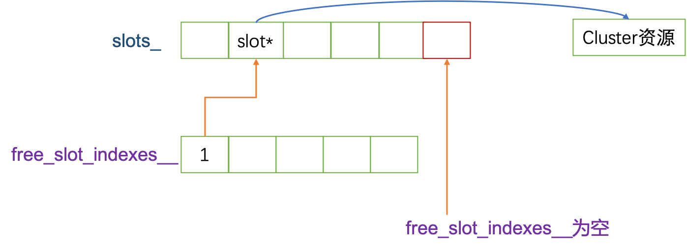
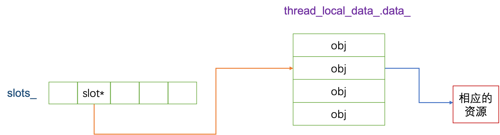
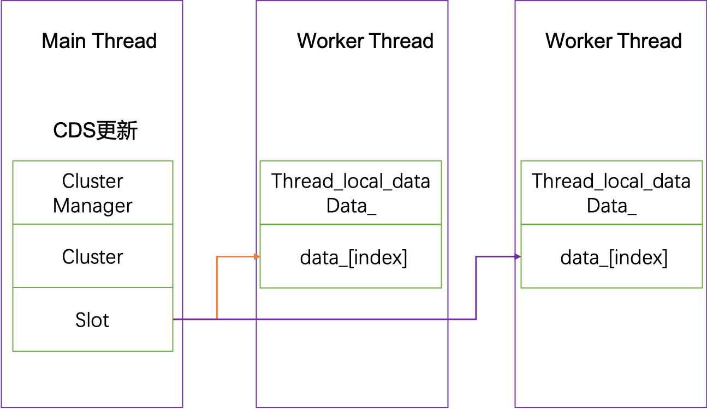

# 线程模型

## 引言

本想在介绍完[envoy架构简介](./envoy架构简介.md)后，讲解server的

初始化流程，但我想，还是先讲清楚envoy所采用的线程模型，以及

**envoy中TLS是如何实现和如何工作的**。

## envoy线程模型

envoy采用的是单进程多线程架构，本篇文章部分参考[envoy线程模型](https://cloud.tencent.com/developer/article/1507300)，

我将上述参考中的线程总览图直接引用如下


由上图可知，envoy目前大致有三类线程

**main线程:** 该线程主要完成一些与请求等无关的工作，譬如XDS更新，

stats flush，相应资源初始化等

**worker线程:** 每个worker线程主要处理请求相关的逻辑，譬如连接建

立，数据读取和转化，同上游创建连接等。

**file flush线程:** 主要是进行日志文件等相关的flush操作

## envoy TLS实现

TLS也即(ThreadLocal Storage,线程局部存储)，其在envoy实现主要在如下目录

[thread_local实现目录](https://github.com/envoyproxy/envoy/tree/v1.15.5/source/common/thread_local)

TLS的粗略实现可参考下图


slots_: Instance内部成员，指向一个SlotImpl*的数组

registered_threads_: Instance内部成员，指向一个Dispatcher的数组

thread_local_data_: Instance内部静态成员变量，其完整定义如下

```c++
  static thread_local ThreadLocalData thread_local_data_;

  struct ThreadLocalData {
    Event::Dispatcher* dispatcher_{};
    std::vector<ThreadLocalObjectSharedPtr> data_;
  };
```

## TLS的使用方式

上述讲解了TLS内部关键的几个成员变量，本部分主要讲解如何使用TLS。

可参考如下代码

```c++
void ThreadLocalStoreImpl::initializeThreading(Event::Dispatcher& main_thread_dispatcher,
                                               ThreadLocal::Instance& tls) {
  threading_ever_initialized_ = true;
  main_thread_dispatcher_ = &main_thread_dispatcher;
  tls_ = tls.allocateSlot();
  tls_->set([](Event::Dispatcher&) -> ThreadLocal::ThreadLocalObjectSharedPtr {
    return std::make_shared<TlsCache>();
  });
}
```

- 调用ThreadLocal::Instance的allocateSlot()接口，分配一个Slot

- 调用Slot的set接口，初始化各个worker中的局部对象数据

- 也可调用Slot的runOnAllThreads接口，在各个worker中执行相应的回调。

## Slot分配过程介绍

slot分配可参考下图



上图需要做如下说明：

- free_slot_indexes_：Instance中成员，存放回收的slot的index

- 分配slot时，先判断free_slot_indexes_是否为空，若为空，则此时slots_已经满了，此时需要添加新的slot，也即上图中红色方块

- 若free_slot_indexes_非空，则说明此时有回收的slot，取free_slot_indexes_的第一个元素，将相应的slot分配给相应的资源

关键代码参考如下

```c++
  if (free_slot_indexes_.empty()) {
    std::unique_ptr<SlotImpl> slot(new SlotImpl(*this, slots_.size()));
    auto wrapper = std::make_unique<Bookkeeper>(*this, std::move(slot));
    slots_.push_back(wrapper->slot_.get());
    return wrapper;
  }

  const uint32_t idx = free_slot_indexes_.front();
  free_slot_indexes_.pop_front();
  .......
  std::unique_ptr<SlotImpl> slot(new SlotImpl(*this, idx));
  slots_[idx] = slot.get();
```

## 线程局部存储资源初始化

这里主要讲解slot如何同相应的资源关联。

初始化线程局部存储资源的方式如下

```c++

tls_->set([](Event::Dispatcher&) -> ThreadLocal::ThreadLocalObjectSharedPtr {
    return std::make_shared<TlsCache>();
  });

```
也即调用slot的set接口，其最终的执行结果可参考下图



上述解释如下

- slot对象会记录自己的index，该index也即是TLS中data_数组中的index

- slot对象的资源是在主线程进行更新，然后通过slot再分发给各个worker，更新相应各个worker的资源

set接口的源码如下
```c++
void InstanceImpl::SlotImpl::set(InitializeCb cb) {
  .....
  for (Event::Dispatcher& dispatcher : parent_.registered_threads_) {
    const uint32_t index = index_;
    dispatcher.post([index, cb, &dispatcher]() -> void { setThreadLocal(index, cb(dispatcher)); });
  }

  ........
}
```
通过每个worker的dispatcher将回调函数post各个worker的事件机制中。

所以在每个worker中最终会执行`setThreadLocal(index, cb(dispatcher));` 函数，其关键代码如下

```c++
 if (thread_local_data_.data_.size() <= index) {
    thread_local_data_.data_.resize(index + 1);
  }

  thread_local_data_.data_[index] = object;
```

## 获取线程局部资源

slot对象提供了如下两个接口获取线程存储局部资源

```c++

  /**
   * @return ThreadLocalObjectSharedPtr a thread local object stored in the slot.
   */
  virtual ThreadLocalObjectSharedPtr get() PURE;

  /**
   * This is a helper on top of get() that casts the object stored in the slot to the specified
   * type. Since the slot only stores pointers to the base interface, dynamic_cast provides some
   * level of protection via RTTI.
   */
  template <class T> T& getTyped() { return *std::dynamic_pointer_cast<T>(get()); }
```
此处用到了template method设计模式，该模式在envoy使用较常见，官员该模式如何使用，可参考[Head First 设计模式（中文版）](https://book.douban.com/subject/2243615/)。

std::dynamic_pointer_cast: 创建 std::shared_ptr的新实例，其存储指针是使用强制转换表达式从r的存储指针获得的。

其一个可能的实现参考[pointer_cast](https://en.cppreference.com/w/cpp/memory/shared_ptr/pointer_cast) 

关于智能指针shared_ptr的讲解可参考:[深入理解智能指针shared_ptr](https://zhuanlan.zhihu.com/p/548864356)

因此，若想获得TlsCache的线程局部资源，则可通过如下方式

```c++
  slot_->getTyped<TlsCache>();
```

## 总结

本文讲解了envoy线程模型及其相应的实现。envoy中采用的资源更新方式为：**主线程更新，然后将相应更新set到各个worker**.

拿CDS更新cluster为例，其过程如下




