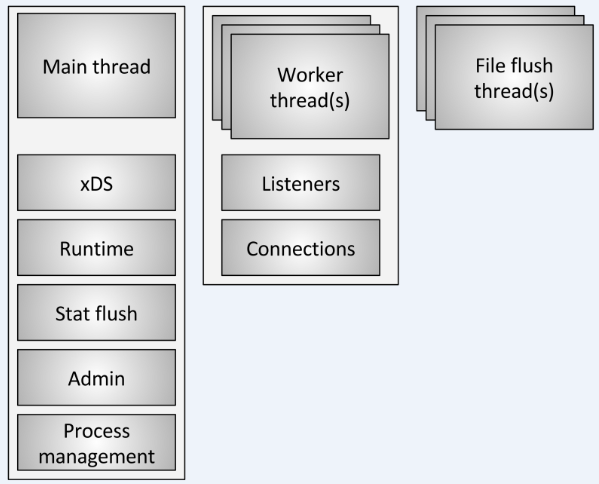
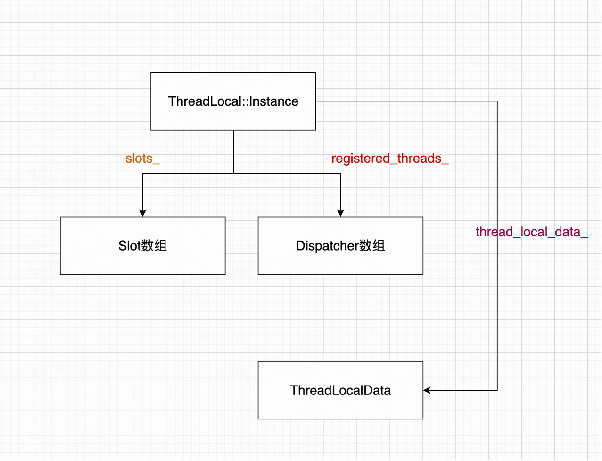

# 线程模型

## 引言

本想在介绍完[envoy架构简介](./envoy架构简介.md)后，讲解server的

初始化流程，但我想，还是先讲清楚envoy所采用的线程模型，以及

**envoy中TLS是如何实现和如何工作的**。

## envoy线程模型

envoy采用的是单进程多线程架构，本篇文章部分参考[envoy线程模型](https://cloud.tencent.com/developer/article/1507300)，

我将上述参考中的线程总览图直接引用如下



由上图可知，envoy目前大致有三类线程

**main线程:** 该线程主要完成一些与请求等无关的工作，譬如XDS更新，

stats flush，相应资源初始化等

**worker线程:** 每个worker线程主要处理请求相关的逻辑，譬如连接建

立，数据读取和转化，同上游创建连接等。

**file flush线程:** 主要是进行日志文件等相关的flush操作

## envoy TLS实现

TLS也即(ThreadLocal Storage,线程局部存储)，其在envoy实现主要在如下目录

[thread_local实现目录](https://github.com/envoyproxy/envoy/tree/v1.15.5/source/common/thread_local)

TLS的粗略实现可参考下图



slots_: Instance内部成员，指向一个SlotImpl*的数组

registered_threads_: Instance内部成员，指向一个Dispatcher的数组

thread_local_data_: Instance内部静态成员变量，其完整定义如下

```c++
  static thread_local ThreadLocalData thread_local_data_;

  struct ThreadLocalData {
    Event::Dispatcher* dispatcher_{};
    std::vector<ThreadLocalObjectSharedPtr> data_;
  };
```

## TLS的使用方式

上述讲解了TLS内部关键的几个成员变量，本部分主要讲解如何使用TLS。

可参考如下代码

```c++
void ThreadLocalStoreImpl::initializeThreading(Event::Dispatcher& main_thread_dispatcher,
                                               ThreadLocal::Instance& tls) {
  threading_ever_initialized_ = true;
  main_thread_dispatcher_ = &main_thread_dispatcher;
  tls_ = tls.allocateSlot();
  tls_->set([](Event::Dispatcher&) -> ThreadLocal::ThreadLocalObjectSharedPtr {
    return std::make_shared<TlsCache>();
  });
}
```

- 调用ThreadLocal::Instance的allocateSlot()接口，分配一个Slot

- 调用Slot的set接口，初始化各个worker中的局部对象数据

- 也可调用Slot的runOnAllThreads接口，在各个worker中执行相应的回调。

## Slot分配过程介绍


